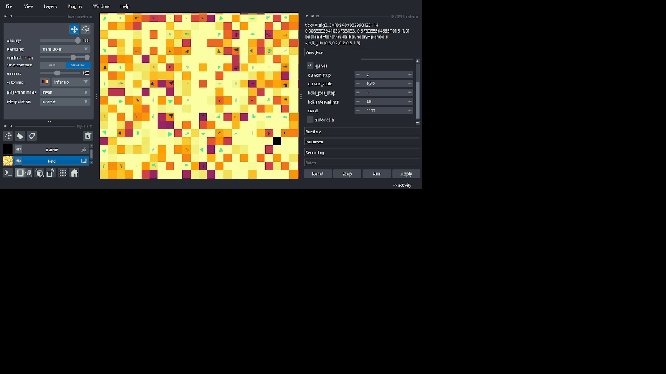

# Demo Assets

This directory contains curated visual demo assets used in public docs and README:
- GIF/MP4 short demos
- key screenshots
- before/after comparison frames

## Captures

### `video_capture_2026-02-13`

Source recording:
- `D:\Videos\2026-02-13 21-46-48.mp4` (local source used for extraction)

Generated assets:
- `docs/assets/video_capture_2026-02-13/demo_capture.gif`
- `docs/assets/video_capture_2026-02-13/demo_01.png`
- `docs/assets/video_capture_2026-02-13/demo_02.png`
- `docs/assets/video_capture_2026-02-13/demo_03.png`
- `docs/assets/video_capture_2026-02-13/demo_04.png`
- `docs/assets/video_capture_2026-02-13/demo_05.png`
- `docs/assets/video_capture_2026-02-13/demo_06.png`

Markdown embed example:

```md

```
