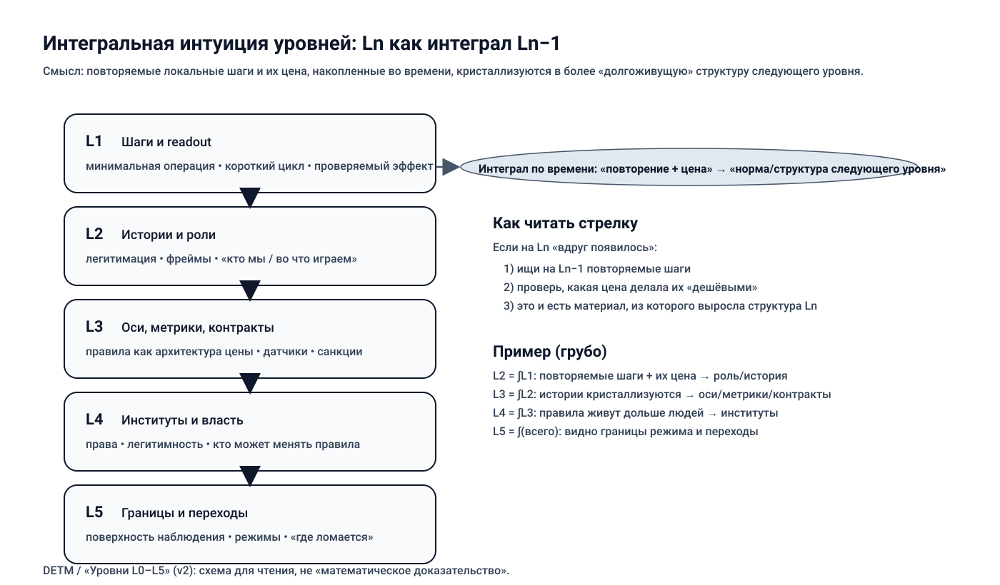
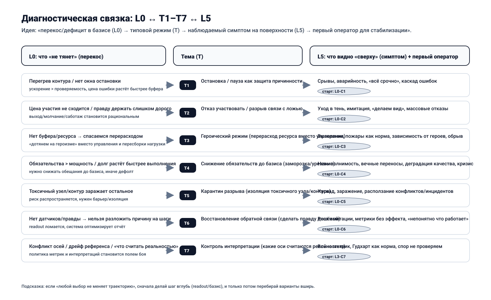
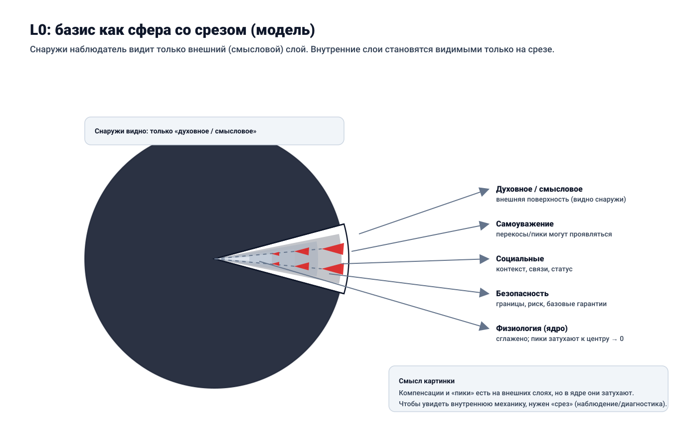

# DETM Book (EN v2) [draft]

_mode: draft_

## Содержание

1. Where to start (short hook, with teeth)
2. Levels map (L0..L5)
3. Quickstart (10 minutes)
4. First aid: 5-minute diagnostic protocol
5. Thesis
6. Reader map
7. How to read this book
8. L0: Existence (0/1) as minimal invariant
9. L1: Behavior and experience (minimal operation)
10. L2: Models, roles, and explanations
11. L3: Governance, rules, and metrics
12. L4: Institutions, power, and capture
13. L5: Boundaries and transitions across levels
14. Terms
15. Case registry
16. Navigation cheat sheet (S-T-C)
17. Invariants and tests
18. Index (terms, themes, operators)

## Where to start (short hook, with teeth)

Imagine a bridge.

From the outside it can look healthy: smooth traffic, clean dashboards, green reports, confident speech.
But a bridge does not stand on speech. It stands on load limits, joints, maintenance windows, corrosion control, and honest stress signals.

Complex human systems fail in the same way.
We usually see words first, and then try to repair reality with more words.
But the break may be elsewhere:

- people ran out of basis resource and can only imitate participation,
- actions no longer produce verifiable effects,
- rules and metrics started training imitation,
- institutions defend captured interests instead of system resilience,
- the active regime has crossed a boundary and no longer converges.

This is neither a moral sermon nor a motivation script.
It is a diagnostic and operator handbook:

1. locate where causality broke,
2. identify the active description level,
3. apply the smallest operator that restores control.

If you keep one idea in mind, keep this one.
If you keep two ideas, let this be the first:

> Most hard conflicts inside systems are conflicts between levels of description.

One actor talks about basis (L0), another about operations (L1), another about narratives (L2), another about metrics and rules (L3), another about institutions and power (L4), and another about boundaries (L5).
They can all be locally correct and still produce global failure together.

Two reading modes for you:

- Fast: open Quickstart, pick the nearest symptom, execute one first operator.
- Deep: go through L0-L5 and reconstruct the causal cascade end-to-end.

If at any point the text feels abstract, treat that as a signal:
you have not fixed the observable inputs and the scene scale yet.

## Levels map (L0..L5)

The model uses six operational levels.

| Level | Question | Typical failure | Typical operator |
|---|---|---|---|
| L0 | Does the system still hold? | basis collapse, fake participation | stop, exit, load reduction |
| L1 | Do actions produce verified effects? | activity without effect | minimal action + readout |
| L2 | Which stories/roles gate behavior? | rationalization, taboo, shame loops | reframe + permission update |
| L3 | Which metrics/rules define reality? | Goodhart, metric theater | axis policy, anti-capture checks |
| L4 | Who can change rules legitimately? | institutional capture | governance reset, veto rights |
| L5 | Where are the regime boundaries? | delayed transition, hard crash | transition protocol |

Use this map as routing logic, not ideology.

## Quickstart (10 minutes)

<a id="quickstart"></a>

Start here if you want the operational core before reading the full theory.
Do not optimize for perfect understanding on first pass; optimize for the first useful move.

### 1) One-sentence summary

Systems optimize what is cheaper to hold right now.
They fail where regime-holding cost stops converging.

### 2) 60-second map (L0-L5)

- **L0 (basis):** is there enough resource/safety/trust/stopping rights for causality to exist?
- **L1 (step -> effect):** do we have a minimal action and readout, or only visible activity?
- **L2 (stories/roles):** which narratives make action allowed, blocked, or shameful?
- **L3 (rules/metrics):** which axes define reality, and who pays the cost of those rules?
- **L4 (institutions/power):** who can change rules and why that is considered legitimate?
- **L5 (boundaries):** where the regime stops converging and transition operators are required.

### 3) Two navigation modes: depth vs breadth

- **Depth-first** when the system does not respond:
  restore causality by descending L3 -> L1 -> L0.
- **Breadth-first** when causality is stable:
  compare options inside allowed space (usually L2-L3).

Quick test:
if "any choice leads to the same trajectory", go depth-first.

### 4) Fast symptom routing

Use the nearest symptom and do one first move.

- "Everything is urgent, fire mode, overload" -> start `L0-C1` (pause/stop as causal protection).
- "People disengage, silent refusal, formal participation only" -> start `L0-C2` (refusal as truth sensor).
- "System survives on heroic overuse" -> start `L0-C3` then `L0-C4` (recognize overspend, reduce obligations).
- "Promises exceed capacity" -> start `L0-C4` (scope/obligation reduction).
- "One toxic node infects everything" -> start `L0-C5` (quarantine coupling).
- "Metrics improve while reality degrades" -> start `L0-C6` and `L3-C6` (restore feedback, break report game).
- "Metric/narrative war, no shared reality axis" -> start `L3-C7` (explicit axis policy).

### 5) Minimal route after quickstart

1. Read [Reader map](#reader-map) and choose your route.
2. Open [Navigation cheat sheet](#nav-cheatsheet) and use `Sx/Ty` and `Lx-Cn` codes.
3. Continue with either:
   - practitioner route: L0 -> L1 -> L3 -> L5,
   - meaning/language route: L0 -> L2 -> L3 -> L5.

## First aid: 5-minute diagnostic protocol

<a id="first-aid"></a>

When you do not know where to start, run this sequence.

1. **Choose scene scale (`S1..S5`)**
   person, family, society/game, organization, state/institutions.

2. **Fix 5-10 observable inputs**
   facts before explanations: what repeats, what is measured, where cost appears.

3. **Choose mode: depth or breadth**
   - if readout is unstable and any choice keeps same failure -> depth (`L1 -> L0`),
   - if readout is stable but goal/axis is unclear -> breadth (`L2-L3`).

4. **Pick one theme and one first operator**
   route via Quickstart symptoms or `S/T/C` cheat sheet.

5. **Validate readout**
   what changed after the step, on what horizon.
   If nothing changed, go one level deeper.

Practical hints:

- Heroic survival mode is usually a price architecture problem, not motivation shortage.
- Metric theater is fixed by restoring sensors and anti-imitation constraints, not by more reporting.
- Meaning conflict with no field effect is often an axis-policy conflict (L3), sometimes basis collapse (L0).

Emergency priority rule:

> Preserve causality first, optimize goals second.

## Thesis

This book is about **how systems hold a regime** and **what price they pay for that stability**.

"System" here can mean person, family, team, organization, institution, or state.
"Regime" means the currently active way of operating: how actions are selected, how feedback is processed, how cost is distributed, and how boundaries are handled.

L0 (basis) is the minimum existence contract:
resource, safety, trust, right to stop, and minimal reversibility.
When basis collapses, causality degrades first, reporting logic replaces reality later.

This is not a management self-help genre.
It is operational philosophy of control via invariants, feedback, and boundaries.

Working axiom:

> Human and institutional behavior minimizes current subjective action cost,
> not abstract global optimum.

That cost includes attention, effort, time, risk, social penalty, conflict price, and hidden future debt.

Practical consequences:

- manage action geometry, not slogans,
- metrics are sensors, not truth,
- rules are cost architecture, not morality,
- refusal (stop/exit/silence/sabotage/imitation) is often a convergence signal, not a character flaw.

Core diagnostic check:

> If report quality is decoupled from pain/cost,
> the system trains reward hacking as a rational strategy.

### What this book gives you

- A level language (`L0..L5`) to separate basis, operations, narratives, rules, institutions, and boundaries.
- A way to detect what basis is truly served, even when declared values say otherwise.
- A causal cascade model from basis distortions to visible themes (`T1..T7`).
- Operator-level routing (`Lx-Cn`) that turns diagnosis into executable action.

### What this book does not promise

- It is not a universal personality theory.
- It is not a one-size-fits-all recipe collection.
- It is not moral arbitration about who is "good".
- It is not medical, legal, or financial advice.

It gives constraints and diagnostics, not ideological certainty.
If reasoning no longer holds in the current basis, this is not "just missing data".
It is a signal that regime price increased and you must change description level.

### Minimal usage protocol

1. Fix observable inputs first (facts before interpretation).
2. Identify active level(s): L0/L1/L2/L3/L4/L5.
3. Detect basis pole under stress and visible surface themes (`T1..T7`).
4. Execute one minimal operator (`Lx-Cn`).
5. Validate with readout. If no effect, go one level deeper.

## Reader map

<a id="reader-map"></a>

This book is a level ladder (L0-L5), but it is best read from your current task, not linearly.
Use the route that matches your role and pressure mode.

### If you are an engineer/practitioner

Goal: restore causality and controllability; reduce imitation cost.

- Prioritize: L0 (basis), L1 (minimal operation/readout), L3 (rules/metrics), L5 (boundaries).
- Typical scenes: S4 (organization), S1 (person).
- Main question: "What makes truthful action cheaper than imitation?"

Route: L0 -> L1 -> L3 -> L5.
Use L2/L4 only when blocked by legitimacy or taboo dynamics.

### If you are a manager/leader

Goal: redesign participation cost so the system does not depend on heroics.

- Prioritize: L0, L3, L4, L5.
- Typical scenes: S4, S5.
- Main question: "Who pays now, and where does the bill surface next month/quarter?"

Route: L0 -> L3 -> L4 -> L5.
Return to L1 when feedback loops are too long or noisy.

### If you are a researcher/analyst

Goal: model systems without collapsing too early into one favorite cause.

- Prioritize: L2 (models/language), L3 (axes/projections), L5 (applicability boundaries), always cross-check with L0.
- Typical scenes: S3-S5.
- Main question: "Which inputs are we not observing, and which axis is silently treated as reality?"

Route: L0 -> L2 -> L3 -> L5 -> L4 (when power distribution matters).

### If you are new to the framework

Goal: get a practical map without overloading with formalism.

- Start from [Quickstart](#quickstart).
- Then read Thesis and How to read.
- Keep three anchors in mind: L0 (basis), L1 (step->effect), L5 (boundary).
- If text feels abstract, jump to [Navigation cheat sheet](#nav-cheatsheet) and route by code.

Route: Quickstart -> Thesis -> How to read -> L0 -> L1 -> (L2 or L3) -> L5.
If this still feels heavy, run only one scene (`Sx`) and one operator (`Lx-Cn`) first.

### Student route

Goal: learn system diagnostics without pretending certainty.

- Start with Quickstart and Level summaries.
- Practice with one real scene and one minimal operator.
- Treat "I do not know yet" as valid diagnostic state.

Route: Quickstart -> Level summaries -> L0 -> L1 -> Appendix.

If the model feels too broad, narrow scene first (S1..S5) before making claims.

## How to read this book

The book is organized as L0-L5, but each level should be read in projection to others:
what this level changes below, and what it looks like from above.

Primary rule:

> Do not transport conclusions outside their basis.

If argument collapses in the current basis, this is often a convergence failure signal, not a debate failure.

Recommended routes:

- Fast route: L0 -> L3 -> L5.
- Engineering route: L0 -> L1 -> L3 -> L4 -> L5.
- Meaning route: L0 -> L2 -> L3 -> L4 -> L5.

### Two orthogonal navigation modes

#### Depth-first (causal reachability check)

Use depth when "the system does not respond":
readout is unstable, any choice yields same failure, or control becomes symbolic.

Depth path: L3 -> L1 -> L0.

Objective: recover minimal causal coupling before optimizing goals.

#### Breadth-first (option search in stable regime)

Use breadth when readout is stable and causality holds.

Breadth usually operates at L2-L3:
change frame, role contract, axis policy, local tactics.

Objective: choose better option inside current boundaries.

Switching rule:

- unstable readout -> depth,
- stable readout -> breadth.

### Integral intuition of levels

A useful reading heuristic:

> Ln is accumulated trace of Ln-1 repeated long enough to become cheap norm.

What appears at higher levels as institution/rule/identity was previously repeated lower-level behavior with convergent cost.

Examples:

- L2 as integral of L1: repeated actions and their prices become narratives/roles.
- L3 as integral of L2: narratives crystallize into metrics/rules/contracts.
- L4 as integral of L3: rules outlive individuals as institutions and sanction systems.
- L5 as integral of all levels: boundary surface where aggregate drift becomes visible.



Operational implication:
if something "suddenly appeared" at Ln, inspect repeated costed patterns at Ln-1.

### Field intuition: one system, multiple control fields

You can read L1-LL4 not as floors, but as interaction fields shaping trajectories:

- L1: short-range action-effect coupling,
- L2: state transformation through roles/identity/story,
- L3: signal and measurement field (Goodhart risk core),
- L4: institutional inertia and sanction gravity,
- L5: observation surface and applicability boundary.

This is not physics reduction of humans.
It is engineering discipline for descriptions:
where causality is preserved, where it is not.

A compact way to remember it:
you can ignore gravity for a while, but gravity still settles the account.
Usually with interest.
In system terms, ignored constraints return as transition debt.

### Practical invariants while reading

1. If one KPI explains everything, you are likely in projection error.
2. If stop/exit rights are taboo, your diagnostics are already biased.
3. If report improves while field signal degrades, switch from optimization to anti-imitation mode.
4. If no operator changes trajectory, descend one level.
5. If conflict persists with no shared axis policy, treat it as L3/L4 issue, not "communication style".

### Minimal chapter protocol

For each chapter do three passes:

1. **Observation pass:** what is directly observable here?
2. **Operator pass:** what is the smallest `Lx-Cn` operator?
3. **Validation pass:** what readout must change if the operator works?

If validation is absent, treat the step as narrative only.

### Diagnostic bridge: L0 <-> T1..T7 <-> L5

The model can be used as one bridge:

- L0: where basis stress originates,
- T1..T7: reusable symptom themes,
- L5: where boundary crossing becomes visible.



### Reading discipline under uncertainty

When you are unsure how to interpret a chapter, apply this fallback discipline:

1. Name the current scene (`S1..S5`) explicitly.
2. Separate observed facts from interpretation in two lists.
3. Pick one tentative operator and one falsification condition.
4. Do not escalate narrative certainty before readout changes.

This prevents the common failure mode where explanation quality grows while control quality declines.
If in doubt, prefer a smaller truthful step over a larger elegant theory.

## L0: Existence (0/1) as minimal invariant

### 1) What L0 means

L0 is the binary fact of regime retention.
A system either remains a system, or degrades into noise.

L0 is not about comfort or success.
It is about minimum conditions under which it still makes sense to discuss behavior (L1), narratives (L2), rules/metrics (L3), institutions (L4), and boundaries (L5).

Operationally:

- `L0 = 1` when basis contracts remain mostly convergent over horizon `T0`.
- `L0 = 0` when basis default becomes systemic and action-consequence coupling breaks.

Typical basis examples:

- person: sleep, food, safety, minimal trust in environment,
- team/org: trust, basic promises, solvency, predictable rules,
- project/product: team energy, feedback channel, budget/time buffer, stop rights.

#### L0 sensors

L0 is not one number. Use coarse multi-signal sensing:

- recurring default on basic obligations,
- imitation replacing real participation,
- "everything is urgent" with no recovery windows,
- withdrawal from meaningful contribution,
- rising effort for shrinking stabilization effect.

Core statement:

> Basis willingness to participate is an early sensor of systemic lie.

Here "lie" is operational: reporting/appearance became cheaper than reality maintenance.

#### L0 operators

L0 operators are rough but honest:

- stop/pause/freeze,
- refusal/exit,
- reduce load to basis capacity,
- restore causality via real feedback and cost return.

From upper levels these may look "irrational" because they do not optimize goals.
They preserve the possibility of future optimization.

#### Basis geometry: need octahedron and skew

Use a geometric intuition:
basis is a compensator balancing multiple poles.



Operational consequence:

- prolonged deficit in one pole creates skew,
- upper levels start optimizing skew maintenance,
- L1 becomes reactive,
- L2 legitimizes "why this is necessary",
- L3 rewrites metrics/rules,
- L4 stabilizes skew as institutional norm.

From outside this may look like "culture degradation".
In this framework it is simpler:
upper levels are servicing basis skew.

#### L0 applicability boundary

Life is continuous, controllability loss is often discontinuous.
You can live long in near-zero with good dashboards.
When basis finally drops, upper levels become non-causal quickly.

### 2) Typical L0 regimes

These are not personality labels.
They are stable trajectories around basis stress.

#### Psychology-scale regimes

**Survival by horizon collapse**:
focus shrinks to next step, not long strategy.
Often a rational attempt to preserve control under basis stress.

**Heroic overspend**:
system is held by sustained overuse (overtime/manual rescue/personal risk).
Short-term wins, long-term debt and abrupt breakdown risk.

**Refusal as self-protection**:
when participation cost exceeds refusal cost,
basis shifts toward exit/silence/formalism.
Not moral failure; convergence signal.

#### Organization-scale regimes

**Trust-maintained regime**:
basic promises mostly hold, exceptions are processed honestly,
error price is not pushed downward.
Upper levels remain causal.

**Fear-imitation regime**:
short horizon can look efficient,
but participation authenticity drops and hidden debt grows.
Sharp breaks follow.

#### Economic incentive regimes

**Solvency as basis**:
without time/money/capacity buffer,
system optimizes survival to tomorrow, not strategic optimum.
Normal for L0, dangerous when denied at L3.

### 3) Cross situations at L0

See unified case layer in [Case registry](#case-registry).
At L0 the action is usually binary: stop/exit/refuse/survival shift.

#### L0-C1: Stop as causal protection

Action: stop process when continuation cost grows faster than benefit.

Effects:

- L1: lower chaos, recovery window appears,
- L2: conflict over meaning (weakness vs responsibility),
- L3: metric reset opportunity,
- L4: legitimacy test (who can stop),
- L5: avoids irreversible branch.

#### L0-C2: Refusal as lie sensor

Action: basis passively stops investing (silent withdrawal/formal compliance/no ownership).

Effects:

- L1: participation quality degrades,
- L2: role-conflict narratives grow,
- L3: report can stay green while reality drops,
- L4: voluntary legitimacy erodes,
- L5: regime boundary approaches quietly.

### 4) Reverse projection: how other levels see L0

- **L1 view**: fatigue/errors/attrition symptoms, often missing basis cause.
- **L2 view**: meaning/identity crisis language, may over-treat with words.
- **L3 view**: capacity constraints, stop rights, feedback viability.
- **L4 view**: participation legitimacy under sanction structure.
- **L5 view**: nearest boundary where current regime stops converging.

### 5) Transition logic (`try/except`)

Allowed:

- descend from L3/L4 to L0 when rules/metrics/institutions induce imitation,
- climb from L0 only after basis stabilization restores causality.

Forbidden:

- patch L0 collapse only with L2 stories or L3 metrics,
- prohibit refusal/exit (this accumulates hidden refusal and creates abrupt failure).

### One-minute summary

- L0 is causal viability (`yes/no`), not personality language.
- When L0 degrades, upper coherence becomes non-causal decoration.
- First operators are usually coarse:
  `L0-C1`, `L0-C2`, `L0-C4`, `L0-C6`.

Action translation:

- protect stop/exit rights,
- reduce obligations to real capacity,
- restore one honest feedback channel before optimization.

### Extended operational notes (L0)

#### A. Basis-first emergency scan

When system state is unclear, run this basis-first scan:

1. Which obligations are already in recurring default?
2. Which actors no longer provide authentic participation?
3. Which recovery channels are collapsed?
4. Which signals are still trustworthy under pressure?
5. Which stop/exit rights are practical, not symbolic?

If questions 1-3 are mostly "yes" and 4-5 are mostly "no",
you are in L0 degradation mode regardless of upper-layer rhetoric.

#### B. Typical L0 illusions

Common misreads that delay repair:

- "We are just tired" while defaults are systemic.
- "People lost motivation" while participation cost exploded.
- "Need stricter control" while basis has no recovery bandwidth.
- "Need better KPIs" while causal viability is already broken.

Treat these as diagnostic alarms, not explanatory endpoints.

#### C. L0 recovery sequencing

Safer order for most basis repairs:

1. Stop escalation (`L0-C1`).
2. Reduce impossible commitments (`L0-C4`).
3. Restore one truthful feedback channel (`L0-C6`).
4. Normalize refusal/exit signal (`L0-C2`).
5. Re-enter L1 control loops only after readout stabilizes.

Reversing this order often recreates hero-mode without basis repair.


## L1: Behavior and experience (minimal operation)

### 1) What L1 means

L1 is the short causal loop:
step -> observation -> correction.

Practical question:

> What changed after the action?

L1 does not exist independently of L0.
It is usually a behavioral response to current basis balance.

When basis is stressed, L1 collapses toward:

- horizon compression,
- triage over planning,
- expensive reflection,
- postponed recovery,
- symbolic activity.

This is often economics, not morality:
what is the cheapest truthful action now that still keeps the regime alive?

#### How L0 pressure maps to `T1..T7` at L1

- restoration deficit -> `T3` heroism or forced `T1` pause,
- resource deficit -> `T4` obligation reduction, then `T2` exit risk,
- safety deficit -> `T2` refusal and `T5` isolation behavior,
- belonging deficit -> `T7` interpretation conflict,
- meaning deficit -> `T2` disengagement or `T6` demand for truthful feedback.

#### L1 sensors

- readout delay,
- incident frequency and recovery time,
- context-switch overload,
- verification quality,
- observable recovery health (sleep/maintenance/buffer integrity).

#### L1 operators

- choose minimal operation,
- define cheap readout,
- shorten cycle,
- reduce parallel load,
- incident review without punishment,
- enforce done=verified.

#### Applicability boundary

L1 cannot rescue structural basis failure alone.
It also cannot compensate captured metric policy (L3) or boundary crossing (L5).
If that is where you are, forcing L1 harder usually makes things noisier, not better.

### 2) Typical L1 regimes

#### Psychology-scale regimes

**Reactive triage loop**:
action from immediate pain only,
with shrinking horizon and false progress feeling.

**Small-step discipline**:
cheap tests and verified increments,
boring externally, highly stabilizing operationally.

**Busyness without verification**:
high action volume, low readout quality.
Control illusion with imitation drift risk.

#### Organization-scale regimes

**Fire culture**:
heroic urgency rewarded,
prevention and recovery deprioritized.

**Operational discipline**:
simple rituals reduce uncertainty:
verification, clear done criteria, non-punitive incident review.

#### Economic incentive regimes

**No-buffer operation**:
when time/money/capacity buffer is absent,
L1 rationally optimizes "avoid immediate default",
not long-horizon quality.

### 3) Cross situations at L1

#### L1-C1: Minimal operation instead of "solve everything"

Choose smallest step that must change available actions/risk/contracts.

#### L1-C2: Minimal readout sensor

One cheap truth channel for "what changed".
Without it, effect is assumed absent.

#### L1-C3: Shorter loop

Smaller batches, faster feedback, lower error cost.

#### L1-C4: Lower parallelism

Stop intake until current work reaches verified completion.

#### L1-C5: Incident review without punishment bias

Treat incidents as signal about operator quality,
not symbolic guilt assignment.

#### L1-C6: Recovery windows as required operation

Recovery is part of throughput contract,
not optional personal luxury.

#### L1-C7: Done = verified

Closure without verification is report, not completion.

### 4) Reverse projection

- **L1-on-L1**: next step + proof of changed state.
- **L2-on-L1**: may call it routine/micromanagement, yet depends on it.
- **L3-on-L1**: execution reality source; if ignored, policy becomes theater.
- **L4-on-L1**: discipline can be protection or coercion, depending on legitimacy.
- **L5-on-L1**: loop speed determines whether boundary appears early or as a shock.

### 5) Transition logic (`try/except`)

Allowed:

- descend from L2 to L1 when semantic conflict loops,
- descend from L3 to L1 when rule exists but causality absent,
- descend from L1 to L0 when loop fails due to basis depletion.

Forbidden:

- replacing L0 repair with endless L1 heroics,
- turning L1 rituals into goals (ritual theater).

### One-minute summary

- L1 is minimal step plus readout.
- Steps without readout produce imitation by default.
- First moves: `L1-C2` and `L1-C5`, then stabilize cycle/parallelism.

Action translation:

- define minimum operation and done=verified,
- attach cheap readout to each step,
- shorten cycle until readout becomes stable.

### Extended operational notes (L1)

#### A. Fast L1 diagnostics in incident mode

Use this sequence when the team says "we are doing a lot, but nothing improves":

1. Select one flow unit (ticket, request, experiment, recovery task).
2. Define one minimal step and one expected state change.
3. Define one readout observable that can be checked within the same horizon.
4. Execute once, measure once, update once.

If this sequence cannot be performed, you are likely not in L1 tuning mode.
You are likely in L0 or L3/L4 conflict mode.
That is not failure; it is useful orientation.

#### B. Typical anti-patterns and counter-operators

- Anti-pattern: closure-by-status updates.
  Counter: bind closure to `done = verified` (`L1-C7`).

- Anti-pattern: infinite "in progress" queue.
  Counter: strict WIP cap and intake stop (`L1-C4`).

- Anti-pattern: incident report as blame report.
  Counter: non-punitive incident review (`L1-C5`).

- Anti-pattern: heroic end-of-cycle sprints.
  Counter: mandatory recovery windows (`L1-C6`).

#### C. Scene-specific readout examples

- S1 (person): sleep quality, error count per day, deferred obligations.
- S2 (family): number of repeated unresolved conflicts per week.
- S3 (society/game): lag between policy move and observable social effect.
- S4 (organization): lead time, escaped defect rate, re-open rate.
- S5 (state): policy latency, contradiction lag, compliance quality.

#### D. Escalation boundary from L1

Escalate from L1 when at least one of the following holds:

- repeated operator execution does not change trajectory,
- readout cannot be trusted due to metric gaming,
- participation authenticity keeps dropping despite local fixes,
- recovery debt accumulates faster than throughput gains.

Then descend to L0 or switch to L3/L5 boundary logic.
In practice, this is often the moment where teams regain clarity.

#### E. Need-skew to behavior map (quick)

When one basis pole dominates, L1 behavior often follows:

- Safety deficit -> risk-avoidant micro-actions, refusal of exposure tasks.
- Resource deficit -> short-horizon decisions, promise compression.
- Recovery deficit -> volatility, error bursts, hero spikes.
- Belonging deficit -> symbolic compliance, lower ownership quality.
- Meaning deficit -> high activity with low commitment persistence.

Use this map to avoid misdiagnosing basis stress as "discipline failure".

#### F. L1 anti-imitation checklist

Before declaring progress, verify all:

- The step had a pre-defined expected effect.
- The readout horizon was specified before execution.
- The readout can be independently checked.
- Completion status matches observed effect, not only ticket state.
- Incident debt did not increase in parallel.

If 2+ checks fail, treat progress claim as provisional.

#### G. Cross-level projection of L1 failures

How L1 failure usually appears upward:

- At L2: endless explanation loops.
- At L3: demand for more KPI control.
- At L4: pressure for stricter enforcement.
- At L5: sudden perception of "unexpected" boundary crossing.

This is why restoring L1 causality early is high leverage.

#### H. L1 recovery ladder (from chaos to control)

Use this ladder when the loop is degraded:

Level 0 (chaos):
- no trusted readout,
- unlimited intake,
- incident handling by urgency only.

Level 1 (basic stabilization):
- one trusted readout exists,
- WIP capped,
- one recovery slot protected.

Level 2 (repeatable control):
- done=verified is enforced,
- incident review updates operators,
- readout lag is bounded and visible.

Level 3 (adaptive execution):
- counter-signals prevent local overfitting,
- cycle tuning is explicit,
- escalation to L3/L5 is trigger-driven, not emotional.

If system cannot move from Level 0 to Level 1 in bounded attempts,
descend to L0 and re-check basis viability.

#### I. Weekly L1 hygiene ritual

Minimal weekly sequence:

1. Pick one completed flow and verify effect evidence.
2. Pick one failed flow and identify operator gap.
3. Remove one source of parallel overload.
4. Protect one recovery window for next cycle.
5. Update one readout definition if it was gameable.

This keeps L1 from sliding back into symbolic productivity.
Small boring consistency here beats heroic cleanup later.

#### J. Typical false positives in L1 success

Do not treat these alone as progress:

- higher closure count with rising reopen rate,
- lower visible incidents with falling report honesty,
- faster cycle with worsening downstream quality,
- improved team velocity with collapsing participation authenticity.

These are often "control-looking" signals hiding deeper drift.


## L2: Models, roles, and explanations

### 1) What L2 means

L2 is the semantics and legitimacy layer:
which stories and roles make actions allowed, forbidden, shameful, or noble.

L2 usually activates because living without explanation became too expensive.
That cost is often rooted in basis skew (L0).

In this framework L2 is not "truth" by itself.
It is a cost compensator:
story and role are selected to make next action socially/emotionally cheaper.
That is exactly why L2 is powerful and risky at the same time.

Integral intuition:
L2 can be read as time-accumulated trace of L1 actions and their prices.

#### Language as labor tool

Language does not just describe; it selects data.

Working rule:

> First fix all observables, then build model.

Common analysis failure:
pre-selecting only "important" inputs and ignoring the rest.
That turns model into projection artifact.
If you feel stuck, return to raw observables first; it usually lowers noise fast.

#### How L0 pressure maps to `T1..T7` through L2

- recovery deficit -> heroism legitimized (`T3`), pause shamed (`T1` blocked),
- resource deficit -> obligation cuts (`T4`) or exit narratives (`T2`),
- safety deficit -> silence/refusal normalization (`T2`) and threat framing,
- belonging deficit -> interpretation war (`T7`),
- meaning deficit -> disengagement (`T2`) or demand for truthful feedback (`T6`).

#### L2 sensors

- interpretation polarization on same facts,
- intention-talk replacing effect-talk,
- disappearance of "we do not know",
- taboo around certain observations,
- gap between sayable and real.

#### L2 operators

- frame shift (what counts as real),
- role assignment/removal,
- legitimation/delegitimation,
- refusal normalization or prohibition,
- explanation redesign that lowers truth cost.

#### Applicability boundary

L2 helps when it restores causality.
L2 harms when it substitutes causality.
When in doubt, keep one foot in L1 readout so the narrative stays grounded.

### 2) Typical L2 regimes

#### Psychology-scale regimes

**Rationalization mode**:
explanation protects current behavior from update.
Energy saved now, debt accumulated later.

**Shame/fear gating**:
truthful acts become emotionally expensive.
Order preserved short-term, feedback damaged long-term.

**Value fixation**:
one identity label defended against evidence.
Transition cost increases sharply.

#### Organization-scale regimes

**Role-as-contract mode**:
roles define who may speak truth and who may stop.

**Shared legend mode**:
cohesion rises, but may require observation censorship.

#### Economic incentive regimes

**Status optimization**:
social penalty minimization dominates causal repair.
Appearance beats effect.

### 3) Cross situations at L2

#### L2-C1: Blame assignment instead of repair

Reduces anxiety quickly, degrades readout quality structurally.

#### L2-C2: Heroism legitimized as norm

Overspend moralized, refusal shamed, collapse risk increased.

#### L2-C3: Stop taboo

Pause reframed as betrayal, forcing emergency-only stopping.

#### L2-C4: Refusal normalization

Exit/refusal made legitimate -> hidden refusal decreases.

#### L2-C5: Reframe reality axis

Switch from prestige narrative to observable effect.

#### L2-C6: Observation taboo

Certain facts become unsayable -> diagnostics collapse.

#### L2-C7: Explanation over experiment

Conversation expands, causal test disappears.

### 4) Reverse projection

- **L1-on-L2**: may dismiss as "talk", but step legality depends on L2.
- **L2-on-L2**: tends to see itself as meaning, not as cost operator.
- **L4-on-L2**: legitimacy infrastructure; whoever controls story controls permissions.
- **L5-on-L2**: hidden refusal grows when truth is unsayable.

### 5) Transition logic (`try/except`)

Allowed:

- descend from L2 to L1 when argument loops,
- descend from L2 to L0 when basis price explodes,
- ascend from L1 to L2 when social/emotional price blocks otherwise valid steps.

Forbidden:

- patching L0 collapse by narrative only,
- banning refusal/stop via shame language.

### One-minute summary

- L2 controls social legality of truth and action.
- Useful L2 lowers truth cost and supports testing.
- Harmful L2 protects explanation against evidence.

Action translation:

- when argument loops, run one minimal test,
- remove taboo on "we do not know",
- normalize stop/exit as valid operators,
- treat frame choice as measurable policy, not identity war.

### Extended operational notes (L2)

#### A. Language discipline protocol

To keep L2 causal instead of rhetorical, use this protocol:

1. Observation pass: list raw observable inputs without interpretation.
2. Frame pass: list at least two competing explanations.
3. Cost pass: for each explanation, state who pays and when.
4. Operator pass: choose one testable L1 step.
5. Readout pass: define what would falsify current explanation.

No falsifiability -> no operational value.
Or more simply: if nothing can disconfirm it, do not run it as policy.

#### B. Taboo detection checklist

You are likely in L2 taboo mode if:

- people can discuss outcomes but cannot discuss certain causes,
- certain actors are exempt from readout scrutiny,
- saying "we do not know" is interpreted as weakness,
- refusal/exit is moralized as betrayal,
- frame-switch is treated as identity attack.

#### C. Role-contract mismatch signals

A role is captured when:

- responsibility exists without authority,
- accountability exists without truthful signal access,
- success requires routine rule violation,
- loyalty cost is lower than truth cost.

#### D. L2 to L3 conversion rule

Convert narrative to policy only when all are true:

- frame is linked to observable axis,
- axis has counter-signal,
- price transfer is explicit,
- rollback condition is defined.

Otherwise, keep it in exploratory mode.

#### E. L2 failure escalation

Escalate beyond L2 when argument volume rises while:

- readout quality falls,
- incident recurrence rises,
- trust in shared reality degrades,
- refusal becomes latent mass behavior.

At that point switch to L3 axis policy or L5 boundary diagnostics.
That switch is not escalation for drama; it is escalation for clarity.

#### F. Frame hygiene rules

To keep interpretation productive:

- Separate observation language from identity language.
- Separate role expectations from moral worth.
- Separate temporary adaptation from permanent norm.
- Separate disagreement on axis from disagreement on person.

These separations reduce unnecessary escalation into capture dynamics.

#### G. L2 warning signs of latent boundary pressure

Watch for these early signals:

- "Any bad signal is disloyal" rhetoric,
- rising use of purity/loyalty labels in operational disputes,
- replacement of readout by authority quotes,
- repeated taboo around stop/exit discussion,
- role narratives that justify sustained overuse.

When such signals cluster, run L1 tests and L3 axis audit immediately.

#### H. Translation bridge: L2 to operator language

Useful conversion pattern:

- Narrative claim -> axis candidate,
- Axis candidate -> observable list,
- Observable list -> minimal L1 experiment,
- Experiment result -> retain/update/drop narrative.

This keeps L2 adaptive instead of dogmatic.

#### I. Narrative stress test

Before adopting a narrative as operating frame, test it:

1. Does it reduce truth cost or increase it?
2. Does it permit refusal/stop where needed?
3. Does it improve L1 readout quality?
4. Does it reduce hidden debt growth?
5. Can it survive one contradictory evidence cycle?

If answers are mostly negative, keep narrative in hypothesis mode only.

#### J. Role redesign micro-protocol

When role conflict blocks progress:

1. List current role expectations and actual authority.
2. Mark where accountability exists without signal access.
3. Mark where authority exists without error-cost ownership.
4. Reassign one responsibility-authority pair.
5. Verify change through one L1 readout cycle.

This prevents endless semantic conflict with no structural update.

#### K. L2 anti-polarization rule set

To avoid collapse into identity warfare:

- debate axes and observables before motives,
- treat contradiction as design input, not loyalty breach,
- separate temporary disagreement from group belonging,
- forbid role labels as substitutes for evidence.

These rules keep interpretation conflict from becoming governance capture.

#### L. When to freeze L2 debates

Freeze semantic debates temporarily when:

- incident rate is rising in real time,
- readout channels are degraded,
- participants cannot agree on minimal shared observables,
- refusal trend increases while discussion volume rises.

In this state, switch to L1/L0 stabilization, then resume L2 work.
You are not abandoning meaning here; you are protecting it from drift.


## L3: Governance, rules, and metrics

### 1) What L3 means

L3 is price architecture.
It decides which actions become cheap, expensive, allowed, or punished.

If L2 shapes legitimacy language,
L3 fixes that language into contracts, metrics, and sanction logic.

Integral intuition:
L3 can be read as time-accumulated trace of L2 narratives/roles.

#### L0 substrate: why L3 is mostly about cost design

L3 is often activated to stabilize basis stress:

- choose axes (what counts as reality),
- set rules/contracts (who owes what),
- establish readout (how effect is verified),
- define who pays error price.

If L0 is stable, L3 is tuning.
If L0 is unstable, L3 becomes conflict over regime retention.

#### KPI as manipulation vs regulation

Working formula:

- KPI is manipulation under wrong basis,
- KPI is regulation under correct basis.

Control test for any KPI:

- can it be decomposed to observables?
- can it be coupled to short readout?
- where does cost surface and who pays?
- where is applicability boundary and stop trigger?

Canonical honest sentence:

> We optimize X and explicitly accept Y losses.

If Y cannot be named, KPI likely functions as power theater.

#### Anti-Goodhart invariant

If report is decoupled from pain/cost,
reward hacking becomes optimal.

#### Search axes: breadth vs depth

Common error:
trying to fix causal failure by metric reshuffling only.

Rule:

- unstable readout or invariant trajectory -> depth (`L3 -> L1 -> L0`),
- stable readout -> breadth (L2/L3 option search).

#### L3 sensors

- metric/observable traceability,
- readout lag and stability,
- green dashboards with degrading field effect,
- hidden cost transfer downstream,
- retrospective KPI reinterpretation.

#### L3 operators

- axis policy,
- metric + counter-metric pairing,
- contract redesign,
- stop rules and load guardrails,
- return error cost to source,
- anti-imitation controls.

#### Applicability boundary

L3 fails in two classic ways:

1. projection error (wrong axes),
2. Goodhart drift (metric becomes goal).

#### 1.1) Social terms as projections (model note)

At L3 many social words behave as projections:
"efficiency", "discipline", "quality", "responsibility", "success".

They are often treated as objective entities, but operationally they are compressed views over selected axes.

Useful engineering posture:

- make axis choice explicit,
- keep projection reversible to observables,
- avoid treating labels as causes.

In practice:

- two actors may use the same word while optimizing different axes,
- metric conflict then appears as semantic conflict,
- semantic conflict then appears as governance conflict.

If you cannot state axis + observable decomposition,
you are probably managing rhetoric, not dynamics.

#### 1.2) Information flow, coherence, and reference stability

Another practical L3 view:
systems coordinate through low-cost repeatable transitions.

Signals survive when they make next-step choice cheaper and more reliable.
Coordination collapses when reference points drift.

Reference drift examples:

- changing KPI definitions after the fact,
- inconsistent unit/quality semantics across teams,
- sanction policy changing faster than rule communication,
- local exceptions silently becoming global norms.

In this language, coherence means:
it is cheaper for the system to keep phase alignment than to lose it.

Loss of coherence appears as:

- repeated contradictory decisions,
- local optimization canceling global effect,
- high communication volume with low convergence,
- rapid growth of meta-control overhead.

### 2) Typical L3 regimes

#### Psychology-scale

**Self-scoring trap**:
visible score optimized, hidden debt ignored.

**Control-as-anesthesia**:
procedure growth reduces anxiety,
but may increase systemic debt.

#### Organization-scale

**Rule architect mode**:
truth cheap, lie expensive, stop rights protected.

**Index-builder capture mode**:
index becomes reality language and power instrument.

#### Economic incentive mode

**Contract designer mode**:
error cost returned to source -> hiding errors is expensive.
Reverse design trains lying.

### 3) Cross situations at L3

#### L3-C1: Metric as sensor, not goal

Metric must validate action-effect coupling.

#### L3-C2: Incentive grows heroism

Short-term speed rewarded over long-term resilience.

#### L3-C3: Re-sign obligations to capacity

Promises realigned to basis power.

#### L3-C4: Stop-rule guardrail

Formal limit on escalation/load growth.

#### L3-C5: Return error cost to source

Prevent downward hidden cost transfer.

#### L3-C6: Break report game

Remove reward for representational output without field effect.

#### L3-C7: Explicit axis policy

Declare which projections define reality and how they are audited.

### 4) Reverse projection

- **L1-on-L3**: bureaucracy if no effect, protection if it lowers chaos.
- **L2-on-L3**: conflict is often over axis choice, not numbers.
- **L4-on-L3**: axis control is power control.
- **L5-on-L3**: Goodhart can hide approaching boundary.

### 5) Transition logic (`try/except`)

Allowed:

- descend L3 -> L1 when rule exists but causality absent,
- descend L3 -> L0 when policy drains basis,
- ascend L2 -> L3 when semantic conflict needs explicit contracts.

Forbidden:

- fixing L0 collapse by KPI pressure,
- allowing metrics to become untouchable goals.

### One-minute summary

- L3 designs behavioral cost architecture.
- Good L3 makes truth cheap and lie expensive.
- Bad L3 creates dashboard theater and accelerates collapse.

Action translation:

- bind metrics to observables and counter-signals,
- enforce stop rights and load limits,
- return error cost to source,
- make axis policy explicit and auditable.

### Extended operational notes (L3)

#### A. KPI transparency worksheet

For each KPI, explicitly document:

- optimized variable,
- non-optimized but affected variables,
- expected side-effects,
- delay profile,
- counter-metric,
- stop condition,
- rollback procedure,
- ownership of error-cost.

If worksheet cannot be filled, KPI is not deployment-ready.

#### B. Axis-policy conflict signatures

You are likely in axis conflict (`T7`) when:

- two teams use same words for different observables,
- metric improves in one subsystem while cross-system reliability degrades,
- interpretation authority is centralized without audit,
- axis changes are applied retrospectively to "save" report quality.

#### C. Anti-Goodhart implementation patterns

- Pair every target metric with a damage detector.
- Ban bonus logic that can be maximized by representational output alone.
- Require sample-based trace validation for high-impact KPI claims.
- Make inability to measure side-effects an explicit deployment blocker.

#### D. Rule quality heuristics

A rule is likely healthy if:

- it decreases diagnostic latency,
- it lowers hidden debt growth,
- it increases truthful signal survival,
- it can be rolled back without regime shock.

A rule is likely captured if the opposite holds.

#### E. L3 boundary escalation

Escalate to L5 if repeated rule changes produce:

- metric volatility without reliability recovery,
- widening gap between report and lived reality,
- persistent refusal masked as compliance,
- rising intervention energy with shrinking control gain.

#### F. L3 review ritual (practical)

For high-impact policy updates, run this short review:

1. Define the axis set explicitly.
2. Define one counter-axis per primary axis.
3. Name error-cost owner and lag horizon.
4. Name stop trigger and rollback command.
5. Run one bounded pilot with trace evidence.
6. Decide deployment only if pilot improves both primary and counter signals.

If steps 2-4 are skipped, deployment risk is high by default.

#### G. "Schedule + attendance" projection trap

Common L3 distortion:
presence in time-space is rewarded as a surrogate for value creation.

This is not always wrong; it becomes wrong when:

- schedule cannot be adapted to observed reality,
- attendance dominates causal output checks,
- pressure for visibility exceeds pressure for verification.

Then report quality can rise while system quality falls.

#### H. Projection failure examples by scene

Use these as recognition anchors.

**S1 (person):**
"Productive day" is defined by hours-at-desk.
Result: effort signal rises, recovery and outcome quality drop.
Fix: switch axis to verified progress + recovery integrity.

**S2 (family):**
"Good parent/partner" is defined by visible sacrifice.
Result: heroism rewarded, boundaries and honest repair degraded.
Fix: add axis for conflict repair completion and shared load balance.

**S3 (society/game):**
"Stability" is defined by absence of visible dissent.
Result: refusal goes underground, legitimacy debt grows.
Fix: track participation authenticity and contradiction visibility.

**S4 (organization):**
"Execution quality" is defined by sprint closure count.
Result: reopen rate and escaped defects increase.
Fix: pair closure metric with defect escape and customer impact.

**S5 (state):**
"Governance success" is defined by formal compliance volume.
Result: compliance quality decouples from real acceptance.
Fix: include voluntary adherence and reversibility outcomes.

#### I. KPI lifecycle states

Every KPI usually passes through states:

1. **Exploratory sensor**:
   used to observe unknown dynamics.
2. **Control sensor**:
   used in bounded corrective loops.
3. **Target metric**:
   enters reward/sanction architecture.
4. **Captured metric**:
   optimized as representation, not reality.
5. **Retired or redesigned metric**:
   replaced due boundary drift.

Healthy L3 keeps explicit rules for state transitions.
Most metric theater begins when state 3 is entered without anti-capture controls.

#### J. L3 governance packet for high-impact metric changes

Before deploying a metric that affects budget, staffing, sanctions, or public claims,
publish a short governance packet:

- axis definition and decomposition to observables,
- known blind zones and expected side effects,
- counter-metric set and contradiction thresholds,
- explicit owner of downstream error-cost,
- stop trigger and rollback command path,
- audit cadence and independent verification route.

If packet is missing, treat metric as experimental only.

#### K. Practical boundary question set

Ask these questions in any serious L3 review:

1. Which behavior becomes cheaper because of this metric?
2. Which harmful behavior also becomes cheaper as side effect?
3. Who can no longer speak truth after this policy shift?
4. Where does cost appear if field reality diverges?
5. What signal tells us the metric has become theater?

If answers are unclear, delay rollout and return to sensor-design stage.

#### L. Minimal weekly L3 control cycle

A lightweight governance loop that keeps metric policy honest:

1. Review top 3 target metrics and their counter-metrics.
2. Check one fresh field trace for each metric pair.
3. Log one contradiction and how it was resolved.
4. Verify stop/rollback triggers are still executable.
5. Decide: keep, adjust, freeze, or retire each metric.

Expected outcome over time:

- lower contradiction lag,
- earlier detection of projection drift,
- reduced dependence on symbolic reporting,
- better handoff from L3 tuning to L5 transition when needed.

If this cycle repeatedly finds no contradictions,
that is often a warning sign by itself: either observability is weak,
or contradiction channels are being filtered out.


## L4: Institutions, power, and capture

### 1) What L4 means

L4 is the layer where rules become durable across time.
It defines who may change rules, who applies sanctions,
and where truthful speech is institutionally protected or punished.

If L3 writes policy,
L4 determines whether policy remains causal or gets captured.

Integral intuition:
L4 can be read as accumulated trace of L3 rule practice over time.

#### L0 substrate: why L4 is about participation retention

Institution survives while participation remains cheaper than exit/sabotage/imitation.
So L4 is participation-price infrastructure:

- legitimacy of rule changes,
- sanction distribution,
- truth channel protection,
- stop/exit rights.

Stable L0 -> L4 can stay mostly invisible.
Unstable L0 -> L4 becomes central conflict arena.

#### How L0 pressure appears as `T1..T7` at L4

- safety deficit -> quarantine and exit-control pressure,
- resource deficit -> heroism institutionalization risk,
- trust deficit -> axis-control and feedback-institution conflict,
- legitimacy deficit -> belonging war and interpretation monopoly struggle.

#### L4 sensors

- practical stop/veto availability,
- who controls interpretation axes,
- whether truthful reporting is sanction-safe,
- capture signals: narrow interest wins over basis viability.

#### L4 operators

- institutionalize veto/stop rights,
- protect refusal and truth channels,
- install anti-capture structures,
- distribute sanction power,
- make high-impact decisions reversible.

#### Applicability boundary

L4 is slow.
Use it as stability architecture, not instant firefighting.

### 2) Typical L4 regimes

#### Psychology and actor-level patterns

**Order-through-control preference**:
predictability is bought by stricter control,
which can become hidden basis drain.

**Cynical adaptation**:
actors optimize around who enforces, not what is true.
Imitation normalizes.

#### Organization/institution patterns

**Institutional architect mode**:
anti-capture, truthful feedback, legal stop rights.

**Capture mode**:
axis monopoly, hidden cost transfer,
exit suppression, truth suppression.

#### Incentive macro-pattern

**Sanction monopoly**:
can create order,
but without anti-capture it also creates systemic lie.

### 3) Cross situations at L4

#### L4-C1: Stop/veto right as institution (`T1`)

Stopping becomes legal routine, not heroic exception.

#### L4-C2: Protect refusal and truth (`T2/T6/T7`)

Whistle/exit/truth rights are enforceably protected.

#### L4-C3: Institutionalized heroism (`T3`)

Overuse rewarded as norm; collapse risk accumulates.

#### L4-C4: Legitimate promise reduction (`T4`)

Capacity mismatch can be resolved without legitimacy collapse.

#### L4-C5: Anti-capture quarantine (`T5`)

Audit/rotation/separation/transparency/reversibility to localize capture.

#### L4-C6: Honest feedback institution (`T6`)

Truth channels no longer depend on personal courage only.

#### L4-C7: Axis governance institution (`T7`)

Interpretation control is formalized and checked.

### 4) Reverse projection

- **L1-on-L4**: looks like politics, but defines whether truth/stop are possible.
- **L2-on-L4**: legitimacy engine for "who may say what".
- **L3-on-L4**: determines whether good rules survive.
- **L5-on-L4**: small institutional shifts can trigger large regime bifurcations.

### 5) Transition logic (`try/except`)

Allowed:

- descend L4 -> L3 to formalize power into auditable rules,
- descend L4 -> L0 when participation viability is broken,
- ascend L3 -> L4 when causal rules cannot persist without institutional protection.

Forbidden:

- attempting anti-capture with metrics only,
- banning refusal/exit (builds hidden refusal and abrupt transition risk).

### One-minute summary

- L4 defines who can rewrite reality in practice.
- If truth/stop/exit are institutionally blocked,
imitation and hidden refusal become rational.

Action translation:

- codify stop/truth rights,
- install anti-capture barriers,
- ensure reversible governance,
- legitimize obligation reduction when basis cannot sustain promises.

### Extended operational notes (L4)

#### A. Early capture warning signals

Monitor for these institutional drifts:

- single-center interpretation monopoly,
- truth channels dependent on personal patronage,
- sanctions applied asymmetrically by affiliation,
- policy reversibility disappearing in practice,
- formal rights existing only on paper.

#### B. Minimal anti-capture toolkit

- distributed veto and stop rights,
- separation of rule design and rule audit,
- mandatory decision traceability,
- periodic authority rotation,
- explicit conflict-of-interest declarations,
- protected channels for contradictory evidence.

#### C. Institutional truth-protection test

Truth protection is real only if:

- reporting bad news does not require heroics,
- whistle-like behavior has enforceable safeguards,
- refusal/exit can be exercised without retaliation,
- corrective action follows signal in bounded time.

#### D. Legitimacy debt dynamics

Legitimacy debt grows when:

- promises are kept symbolically but broken operationally,
- rules are stable but applied selectively,
- participation is measured by obedience only,
- trust recovery is delegated to rhetoric.

When legitimacy debt grows, refusal and shadow participation rise.

#### E. Escalation from L4 to L5

Move to L5 transition planning when:

- institutional corrections no longer change trajectory,
- anti-capture controls are systematically bypassed,
- participation authenticity keeps falling despite sanctions,
- public rule-language and field dynamics diverge persistently.

#### F. Institutional failure signatures by scene

Use this pattern map when diagnosing whether you are facing ordinary policy drift or true institutional capture.

**S1 (person as institution of self-governance):**
- stop-right exists conceptually but never exercised,
- self-sanction logic punishes truthful self-report,
- "discipline" language hides basis depletion.

**S2 (family/close network):**
- one actor has de facto veto with no accountability,
- conflict repair channels depend on mood/status hierarchy,
- refusal signals are recoded as moral failure only.

**S3 (society/game layer):**
- norm enforcement asymmetry by group membership,
- contradiction channels informally discouraged,
- symbolic legitimacy maintained while trust evaporates.

**S4 (organization):**
- audit function depends on same authority it audits,
- escalation paths exist on paper but not in practice,
- policy reversals happen unofficially, without traceability.

**S5 (state/institutions):**
- interpretation monopoly grows while independent readout shrinks,
- emergency mechanisms become persistent governance substrate,
- legal form preserved while correction capacity degrades.

#### G. Anti-capture design principles (compact)

Treat these as practical architecture constraints:

1. **Reversibility**: high-impact decisions must have tested rollback paths.
2. **Separation**: rule definition, enforcement, and audit cannot be fully merged.
3. **Traceability**: policy changes require explicit change logs and rationale.
4. **Contestability**: sanctioned channels must exist to challenge interpretation.
5. **Stop-right practicality**: stop rights must be executable without heroics.
6. **Refusal visibility**: refusal must be measurable as signal, not only suppressed as deviance.

Violation of 3+ principles usually indicates active institutional fragility.

#### H. Legitimacy recovery protocol

When legitimacy debt is already high, use a staged protocol:

Stage 1 (signal safety):
- protect contradiction and refusal reporting channels,
- suspend punitive response to truthful diagnostics.

Stage 2 (contract realism):
- re-sign obligations to actual capacity,
- publish who pays transition cost and when.

Stage 3 (governance repair):
- restore audit independence,
- demonstrate at least one real rollback event.

Stage 4 (trust re-compounding):
- maintain stable rule semantics over multiple cycles,
- avoid symbolic over-promising while basis is still recovering.

Skipping stage 1 often causes stage 3 to fail, even with technically correct policy design.

#### I. Minimal weekly L4 governance check

Run this short check for institutional hygiene:

1. Did at least one uncomfortable signal travel without retaliation?
2. Was at least one high-impact decision traceably auditable?
3. Are stop/exit rights practically usable this week?
4. Did any rule require silent exception to remain operational?
5. Is refusal trend becoming more transparent or more hidden?

Two negative answers in a row should trigger explicit anti-capture review.


## L5: Boundaries and transitions across levels

### 1) What L5 means

L5 is boundary and transition logic.
It does not add another optimization objective.
It asks whether current regime is still convergent.

If L0 is existence viability,
L5 is where cumulative drift becomes visible:

- which basis pole is truly served,
- where holding cost stops converging,
- how local optimizations combine into regime shift.

Integral intuition:
L5 can be read as accumulated trace of L0-L4 dynamics over time.

#### Surface interpretation of `T1..T7`

At L5 themes appear as boundary forms:

- `T1`/`T4`: load reduction to avoid default,
- `T2`: participation non-convergence becomes refusal,
- `T3`: heroic overspend postpones transition until abrupt break,
- `T5`: cascade localized or system-wide contagion,
- `T6`/`T7`: feedback and axis policy either recover causality or hide boundary.

#### L5 as observation surface

L5 shows aggregate vectors:
debt accumulation, incentive skew, feedback loss, axis divergence, trust breakdown.

Use L5 to predict regime gradients, not deterministic individual trajectories.
This framework is for boundary diagnostics, not personal prophecy.

#### L5 as operator over organization scene (S4 -> S5)

At S5 scale (state/institutional operator),
L5 reveals which basis poles are actually protected:

- safety,
- contract predictability,
- health/survival,
- learning/adaptation capacity,
- anti-cascade buffering.

This is not moral ranking.
It is an operational map of where regime price is paid.

#### L5 sensors

- readout disappearance,
- regular basis defaults,
- report replacing causality,
- heroism normalized as baseline,
- mass hidden refusal.

#### L5 operators

- explicit transition trigger criteria,
- legal stop/exit pathways,
- debt-limited contraction,
- cascade localization,
- basis/axis rebasing.

#### Applicability boundary

L5 is expensive and disruptive.
Do not invoke transition logic for ordinary tuning.
Invoke it when non-convergence is evident.

#### 1.1) What L5 can and cannot predict

L5 is useful for regime prediction, not person prediction.

Usually predictable:

- direction of cost gradients,
- likely refusal zones,
- feedback collapse probability,
- transition pressure accumulation.

Usually not predictable with integrity:

- exact individual trajectories,
- exact timing of singular actor behavior,
- one-cause deterministic narratives in high-noise systems.

Treat L5 as boundary diagnostics, not prophecy.

#### 1.2) Why boundaries look sudden

Boundary crossing often looks abrupt at the surface,
while underlying drift has been accumulating for a long time.

Typical pattern:

1. local fixes still work but with shrinking gain,
2. control effort rises faster than stabilization effect,
3. readout contradictions are reclassified as noise,
4. transition trigger is delayed,
5. visible rupture appears "unexpectedly".

So "sudden collapse" is often "unseen accumulation".

### 2) What must be visible at L5

For each level, make explicit:

- which pain/need is active at L0,
- what each level is locally optimizing,
- where the bill appears,
- which boundary type is approaching.

Compact level map:

- L0: existence viability,
- L1: short-loop controllability,
- L2: role/meaning coherence,
- L3: rule/metric cost design,
- L4: institutional correction capacity,
- L5: boundary crossing and regime replacement.

#### 2.1) Level-by-level local optimization map

Use this map when diagnosing cross-level confusion:

- L0 optimizes survival of causal viability.
- L1 optimizes short-loop controllability.
- L2 optimizes meaning/role coherence.
- L3 optimizes policy/metric consistency.
- L4 optimizes institutional legitimacy and correction rights.
- L5 optimizes safe regime replacement under non-convergence.

Most high-stakes failures are not failures inside one level.
They are failures of handoff between these local optimizations.

#### 2.2) Boundary evidence checklist

Boundary evidence is strong when several of these co-occur:

- repeated rule revisions with no trajectory improvement,
- rising intervention energy with falling trust in readout,
- widening report-field gap across independent channels,
- spread of formal participation and hidden refusal,
- collapse of reversibility in governance actions.

When 3+ signals persist, treat transition planning as required, not optional.

### 3) Cross situations at L5

#### L5-C1: Stop boundary

Define threshold where continuation is non-convergent and stopping is mandatory.

#### L5-C2: Transition through mass refusal

Recognize participation non-convergence and choose rebuild or regime collapse path.

#### L5-C3: Heroism bifurcation

Detect point where "one more push" becomes destructive and switch to controlled decline.

#### L5-C4: Capacity/scale boundary

Rescope commitments to restore causality.

#### L5-C5: Cascade boundary

Localize degradation before system-wide contagion.

#### L5-C6: Feedback boundary

Rebuild references/readout when step-effect linkage disappears.

#### L5-C7: Basis/axis rebasing

Replace obsolete reality axes and define new applicability domain.

#### L5 operator sequencing (safe order)

For most systems near boundary, safer order is:

1. `L5-C6` restore feedback visibility,
2. `L5-C1` define hard stop criteria,
3. `L5-C4` contract/scale reduction,
4. `L5-C5` cascade containment,
5. `L5-C7` basis/axis rebasing,
6. `L5-C2`/`L5-C3` when refusal/heroism dynamics dominate.

Skipping feedback restoration often turns transition into symbolic theater.

### 4) Reverse projection

- **L1-on-L5**: appears abstract until abrupt break occurs.
- **L2-on-L5**: interpretation conflict over whether boundary is real.
- **L4-on-L5**: legitimacy battle over who can declare transition.
- **L5-on-L5**: evaluate price convergence, not rhetorical victory.

### 5) Transition logic (`try/except`)

Allowed:

- jump to L5 when boundary signals cluster,
- descend L5 -> L0/L1 to restore causality,
- descend L5 -> L3 for axis/contract redesign,
- descend L5 -> L4 for institutional legitimacy and anti-capture stabilization.

Forbidden:

- banning stop/exit operators,
- cosmetic patching without restoring feedback,
- endless hero-mode postponement,
- tabooing inconvenient observations.

### One-minute summary

- L5 decides planned transition vs structural collapse.
- First move is boundary observability (`L5-C6`), then legal transition operator choice.

Action translation:

- make boundary measurable,
- choose stop/reduce/quarantine/rebase path explicitly,
- remove taboo on refusal and truth,
- restore L0/L1 causality before resuming optimization.

### Extended operational notes (L5)

#### A. Boundary classification grid

Before executing transition, classify boundary type:

- **capacity boundary**: obligations > sustainable power,
- **feedback boundary**: readout no longer tracks effect,
- **legitimacy boundary**: participation collapses despite formal compliance,
- **capture boundary**: interpretation/rule control no longer auditable,
- **cascade boundary**: local failures propagate system-wide.

Different boundaries require different first operators.

#### B. Transition playbook (minimal)

1. Announce boundary and trigger criteria.
2. Freeze new commitments above safe load.
3. Preserve truth channels and contradiction reporting.
4. Execute one contraction/rebase operator.
5. Reset readout panel for new regime.
6. Define explicit exit criteria from transition mode.

#### C. Common transition failure modes

- denial loop: repeated local patches after global non-convergence,
- symbolic transition: naming change without cost architecture change,
- irreversible commitment burst during unstable phase,
- emergency-mode lock-in with no exit criteria.

#### D. Post-transition validation panel

After transition, validate:

- basis default trend,
- readout trustworthiness,
- participation authenticity,
- hidden debt growth rate,
- reversibility of new rules,
- axis-policy transparency.

#### E. L5 discipline rule

Do not optimize local KPI growth immediately after transition.
First stabilize causal coupling.
Only after readout reliability returns should optimization resume.

#### F. Minimal transition governance packet

Before announcing transition completion, publish:

- trigger criteria used,
- operators executed and in what order,
- readout panel before/after,
- obligations re-signed or dropped,
- residual risks and rollback options,
- next review horizon.

Without this packet, post-transition legitimacy usually erodes fast.

#### G. Boundary-to-operator map (`T1..T7` perspective)

When a boundary is detected, this fast map helps choose first operator:

- `T1` overload escalation dominant -> `L5-C1` then `L5-C4`.
- `T2` participation refusal dominant -> `L5-C2` plus `L4-C2`.
- `T3` hero dependence dominant -> `L5-C3` plus incentive redesign at L3/L4.
- `T4` capacity mismatch dominant -> `L5-C4` and contract reset.
- `T5` contagion dominant -> `L5-C5` before broader redesign.
- `T6` readout collapse dominant -> `L5-C6` before any major optimization.
- `T7` axis conflict dominant -> `L5-C7` with explicit governance reset.

Many real transitions combine two or more themes.
In that case prioritize feedback restoration (`T6`) early.

#### H. Transition debt budget

Treat transition as debt-managed process.
Declare three budgets:

- **coordination budget**: how much additional complexity can teams absorb,
- **legitimacy budget**: how much trust loss can be tolerated temporarily,
- **operational budget**: how much throughput decline is survivable.

Without explicit budgets, transition often overextends and causes secondary collapse.

#### I. Anti-regression checks (30/60/90 days)

After initial stabilization, run anti-regression checks:

**Day 30**
- Is readout still truthful under pressure?
- Are stop rights still practical, not symbolic?

**Day 60**
- Did hidden refusal decrease or only change form?
- Did rule reversibility actually work in at least one case?

**Day 90**
- Are new axes producing lower contradiction load?
- Is basis default rate trending down across independent signals?

Failure in 2+ checks means transition is incomplete.

#### J. Typical transition illusions

Common illusions to explicitly guard against:

- **naming illusion**: new labels, old cost architecture,
- **dashboard illusion**: cleaner metrics, same field drift,
- **compliance illusion**: stronger enforcement, weaker legitimacy,
- **hero illusion**: temporary rescue interpreted as regime recovery.

These illusions are expensive because they consume remaining trust budget.

#### K. Minimal "return to optimization" gate

Only return to standard optimization mode when all hold:

- basis stress no longer rising,
- readout/counter-readout pair is stable,
- refusal is visible and actionable (not taboo),
- key rules are reversible in practice,
- transition packet commitments were executed.

Until then, treat system as still in transition discipline mode.


## Terms

<a id="terms"></a>

This is the operational dictionary for this book.
Definitions here are contracts of meaning, not absolute truth claims.

### Human translation (quick hints)

- **Causality**: stable link between action and consequence.
- **Basis (L0)**: what keeps the system alive as a controllable system.
- **Readout**: minimal check that something changed after the step.
- **Regime**: current operating mode and its holding cost.
- **Systemic lie**: reporting became cheaper than reality maintenance.
- **Imitation**: optimization of appearance instead of outcome.
- **Axis/projection**: chosen dimension treated as reality.
- **Sanction**: mechanism that changes action cost.
- **Boundary (L5)**: region where old regime stops converging.

### Quick pointer

- Basis layer: [Regime](#term-regime), [Basis (L0)](#term-basis), [Boundary](#term-boundary)
- Failure signals: [Systemic lie](#term-lie), [Imitation](#term-imitation), [Heroism](#term-heroism), [Capture](#term-capture), [Taboo](#term-tabu)
- Participation economy: [Energy](#term-energy), [Energy readiness](#term-energy-readiness), [Participation](#term-participation), [Minimal operation](#term-minimal-operation)
- Measurement/control: [Readout](#term-readout), [KPI](#term-kpi), [SLA](#term-sla), [Observables](#term-observables), [Input selection bias](#term-input-selection-bias), [Metric](#term-metric), [Rule](#term-rule)
- Institutional/social: [Role](#term-role), [Contract](#term-contract), [Sanction](#term-sanction), [Legitimacy](#term-legitimacy)
- Geometry/model terms: [Need octahedron](#term-need-octahedron), [Axis/projection](#term-axis-projection), [Search axes](#term-search-axes), [Reference](#term-reference), [Observation surface](#term-observation-surface), [Resultant vector](#term-resultant-vector), [Level integral](#term-level-integral), [Coherence](#term-coherence), [Compensator](#term-compensator)

<a id="term-regime"></a>
### Regime

A stable operating mode on a chosen time horizon:
which actions are cheap/expensive,
which signals are accepted as reality,
and what cost is paid to keep causality alive.

<a id="term-basis"></a>
### Basis (L0)

Minimum conditions required for meaningful causality:
resource, safety, trust, stop rights, minimal contractual viability.

<a id="term-boundary"></a>
### Boundary

Region where the current basis/description level stops holding.
Actions stop producing verifiable effect,
rules turn into theater,
and participation no longer converges by cost.

<a id="term-lie"></a>
### Systemic lie (non-moral use)

A mode where sustaining report/story is cheaper than sustaining reality.
The term is economic-operational here, not moral-psychological.

<a id="term-capture"></a>
### Capture

A state where one group can rewrite axes/rules/sanctions in its favor,
while pushing cost downward and suppressing feedback.

Operational marker:
metric/reality conflict is resolved by sanction power, not by evidence.

<a id="term-tabu"></a>
### Taboo

A sanction-backed ban on stating or testing certain observations.
Taboo increases truth cost and accelerates imitation.

<a id="term-energy"></a>
### Energy (in this book)

Not physical energy.
Operationally: subjective current action price
(attention, effort, time, risk, social penalty, shame/fear, conflict cost).

<a id="term-energy-readiness"></a>
### Energy readiness

Behavioral measure of how much energy basis is willing to invest now in this regime.
Usually drops when participation price stops converging.

<a id="term-participation"></a>
### Participation

Operationally: willingness of basis to invest effort/risk/time/attention under current rules.

Forms:

- live participation (contribution + feedback),
- formal participation (ritual compliance without real contribution),
- imitative participation (supporting report instead of reality),
- zero participation (exit/refusal/silence).

<a id="term-minimal-operation"></a>
### Minimal operation

Smallest causal step that must alter the system:
available actions, cost/risk profile, or contract state.

<a id="term-readout"></a>
### Readout

Minimal verification of what changed after a step.
A sensor, not a goal and not a performance ideology.

<a id="term-kpi"></a>
### KPI

A chosen effectiveness indicator used for steering.

KPI risk in this framework:
if KPI becomes goal instead of sensor,
it trains imitation and drifts from basis.

Short formula:
KPI is manipulation under wrong basis,
and regulation under correct basis.

<a id="term-sla"></a>
### SLA

Contract on service obligations (response time, availability, quality constraints, etc.).
Useful L3/L4 example of commitments that must match real basis capacity.

<a id="term-observables"></a>
### Observables (inputs)

Facts that can be honestly fixed before interpretation:
constraints, behavior signals, measurements, repeated patterns.

<a id="term-input-selection-bias"></a>
### Input selection bias

When analysis pre-selects "important" inputs and ignores the rest of observables,
causing conclusions to reflect selection policy, not system reality.

<a id="term-role"></a>
### Role

Structured set of expectations, permissions, and prohibitions.

- At L2: identity/story mask shaping what feels allowed.
- At L3/L4: contract-like package of rights, access, sanctions, accountability.

<a id="term-rule"></a>
### Rule

Constraint/permission that changes action cost:
what is rewarded, what is penalized, who pays.
A rule is valid only if it preserves causality and does not make lie cheaper than truth.

<a id="term-metric"></a>
### Metric

Sensor over a chosen axis.
Without stop rights and decomposition to observables,
metric quickly mutates into target (Goodhart mode).

<a id="term-contract"></a>
### Contract

Explicit or implicit obligation structure:
what is guaranteed, who is accountable, where risk is allocated.

<a id="term-sanction"></a>
### Sanction

Mechanism that changes action price:
penalty, access loss, reputational hit, threat, reward.

<a id="term-legitimacy"></a>
### Legitimacy

Reason why acceptance is cheaper than resistance:
trust, law, procedure, habit, fear, benefit.
Fear-only legitimacy degrades participation into imitation or exit.

<a id="term-imitation"></a>
### Imitation

Regime where producing appearance/report is cheaper than preserving reality.
An economic optimum under bad cost architecture.

<a id="term-heroism"></a>
### Heroism

Not virtue language here.
A regime of basis overspend:
continuous overeffort, manual control, burnout risk.
Short-term stabilizing, long-term debt-amplifying.

<a id="term-compensator"></a>
### Compensator

Internal balancing contour that keeps L0=1 by redistributing pressure.
When compensator fails, upper levels are forced to service lower-level distortions.

<a id="term-need-octahedron"></a>
### Need octahedron (model)

Geometric metaphor of basis with multiple poles kept in dynamic balance.
Dominance of one pole appears as basis skew;
upper levels then optimize skew maintenance instead of global stability.


<a id="term-axis-projection"></a>
### Axis / projection

Axis: selected dimension used to compress reality (speed, money, safety, control, etc.).
Projection: state value on that axis.
Many social terms are hidden projection labels.

<a id="term-search-axes"></a>
### Search axes: breadth vs depth

Breadth search:
option exploration inside fixed depth (mostly L2-L3),
without rebuilding basis.

Depth search:
causal descent (L3 -> L1 -> L0),
restoring readout and truth/stop/exit rights.

Switch rule:
unstable readout -> depth,
stable readout -> breadth.

<a id="term-reference"></a>
### Reference

Stable comparison anchor over time:
units, contracts, interfaces, interpretive rules.
Reference drift breaks coherence and increases holding cost.

<a id="term-observation-surface"></a>
### Observation surface (L5)

Boundary surface where aggregate effects of lower levels become visible:
incentive skew, feedback loss, debt accumulation, axis divergence.

<a id="term-resultant-vector"></a>
### Resultant vector (model)

Combined direction produced by multiple influences/skews.
Useful to describe aggregate drift without premature single-cause reduction.

<a id="term-level-integral"></a>
### Level integral (model)

Intuition of accumulation over time:
Ln can be read as accumulated trace of Ln-1.

Examples:

- L2 = integral of L1 actions,
- L3 = integral of L2 narratives,
- L4 = integral of L3 rules,
- L5 = integral of whole stack.

<a id="term-coherence"></a>
### Coherence (in this book)

Stable phase-like alignment across system parts on chosen axes.
Visible when measurements repeat and actions add up rather than cancel out.

Economically:
coherence is when keeping phase is cheaper than losing it.

## Case registry

<a id="case-registry"></a>

The same base situation should stay semantically consistent across the book:
one theme `T<n>` viewed through different levels `L0..L5` and scenes `S1..S5`.

Identifier layers:

- `T<n>`: cross-level theme (semantic pattern),
- `Lx-Cn`: operator variant at a specific level.

### Theme template (`T<n>`)

- Pattern name
- L0 pain/need under protection or failure
- Real optimization objective
- Where price appears and who pays
- Short conclusion
- Linked operator variants (`Lx-Cn`)

### Operator template (`Lx-Cn`)

- ID
- Level and action
- Observable effects (L1-L5)
- Cross-level interpretation

### Scene carriers (`S1..S5`)

Same theme must be legible in multiple scales:

- `S1`: person
- `S2`: family/close network
- `S3`: society/game layer
- `S4`: organization/team/lab/company
- `S5`: state/institutional operator

Mini vignette structure for each scene:

- observables (5-10 facts),
- one minimal operation,
- readout horizon,
- price transfer (who pays, when, where).

### Cross-book themes (`T1..T7`)

- `T1`: pause/stop as causal protection
- `T2`: refusal/exit as truth signal
- `T3`: heroic overspend mode
- `T4`: obligation reduction to basis capacity
- `T5`: quarantine of toxic coupling
- `T6`: feedback restoration
- `T7`: interpretation/axis control

### Theme-to-scene matrix (entry points)

#### T1: pause / stop

- S1: stop self-overload to recover causal capacity.
- S2: pause escalation before trust damage compounds.
- S3: freeze game incentives to prevent collapse spiral.
- S4: stop work inflow to protect quality and safety.
- S5: declare emergency brakes with legal legitimacy.

Typical first operators: `L0-C1`, `L3-C4`, `L4-C1`.

#### T2: refusal / exit

- S1: refusal to continue personal imitation contract.
- S2: silence/withdrawal as family safety signal.
- S3: mass non-participation in unfair game.
- S4: disengagement when truth becomes punishable.
- S5: institutional non-compliance as transition signal.

Typical first operators: `L0-C2`, `L2-C4`, `L4-C2`, `L5-C2`.

#### T3: heroism

- S1: burnout-driven self-control illusion.
- S2: one member carrying system debt alone.
- S3: hero narrative replacing rule quality.
- S4: overtime as hidden production substrate.
- S5: emergency governance normalized as baseline.

Typical first operators: `L0-C3`, `L0-C4`, `L3-C2`, `L4-C3`, `L5-C3`.

#### T4: obligation reduction

- S1: remove promises above real power.
- S2: narrow commitments to sustainable care.
- S3: reduce collective demand under constraint.
- S4: re-sign SLA/scope under real capacity.
- S5: legal downscaling to avoid systemic default.

Typical first operators: `L0-C4`, `L3-C3`, `L4-C4`, `L5-C4`.

#### T5: quarantine

- S1: isolate recurring toxic trigger/channel.
- S2: protect family boundary from contagion pattern.
- S3: isolate cheating/corruption propagation node.
- S4: quarantine process/component/team causing cascade.
- S5: institutional firebreak against capture spread.

Typical first operators: `L0-C5`, `L4-C5`, `L5-C5`.

#### T6: feedback restoration

- S1: restart self-honest sensing without punishment.
- S2: restore conversation with testable commitments.
- S3: rebuild trustable public signals.
- S4: reconnect KPI/report to field observables.
- S5: institutionally protect truthful signal channels.

Typical first operators: `L0-C6`, `L1-C2`, `L3-C1`, `L3-C6`, `L4-C6`, `L5-C6`.

#### T7: axis/interpretation control

- S1: remove taboo on key self-observations.
- S2: align family frame on what counts as reality.
- S3: conflict of meaning/projection regimes.
- S4: metric war over governing axis definitions.
- S5: monopoly struggle over legal reality language.

Typical first operators: `L2-C5`, `L2-C6`, `L3-C7`, `L4-C7`, `L5-C7`.

### Operator catalog (short form)

#### L0 operators

- `L0-C1`: pause/stop as causal protection
- `L0-C2`: refusal as lie sensor
- `L0-C3`: diagnose basis overspend
- `L0-C4`: reduce obligations to capacity
- `L0-C5`: quarantine toxic coupling
- `L0-C6`: restore honest feedback
- `L0-C7`: exit report game

#### L1 operators

- `L1-C1`: minimal operation instead of "do everything"
- `L1-C2`: minimal readout sensor
- `L1-C3`: shorter cycle
- `L1-C4`: lower parallelism
- `L1-C5`: failure review without punishment
- `L1-C6`: built-in recovery windows
- `L1-C7`: done = verified

#### L2 operators

- `L2-C1`: blame assignment instead of repair
- `L2-C2`: heroism legitimized as norm
- `L2-C3`: stopping taboo
- `L2-C4`: refusal normalized
- `L2-C5`: frame/axis reinterpretation
- `L2-C6`: taboo on observation
- `L2-C7`: explanation replacing experiment

#### L3 operators

- `L3-C1`: metric as sensor, not goal
- `L3-C2`: incentive grows heroism
- `L3-C3`: obligations re-signed to capacity
- `L3-C4`: stop rule / load limiter
- `L3-C5`: return error cost to source
- `L3-C6`: break report game (anti-imitation)
- `L3-C7`: explicit axis policy

#### L4 operators

- `L4-C1`: institutional stop/veto rights
- `L4-C2`: protect refusal and truth rights
- `L4-C3`: institutionalized heroism
- `L4-C4`: legitimate promise reduction
- `L4-C5`: anti-capture quarantine
- `L4-C6`: institution of honest feedback
- `L4-C7`: institution of axis governance

#### L5 operators

- `L5-C1`: stop boundary criterion
- `L5-C2`: transition through mass refusal
- `L5-C3`: heroism bifurcation management
- `L5-C4`: capacity/scale boundary reset
- `L5-C5`: cascade boundary localization
- `L5-C6`: feedback boundary restoration
- `L5-C7`: basis/axis rebasing

### Detailed scene vignettes (`Sx/Ty`)

The goal of this block is practical recognition.
For each theme we give a scene-specific signature, one minimal move, and one readout hint.

#### S1: Person (basis / compensator)

- `S1/T1` pause: overload loop, sleep collapse, repeated mistakes -> stop intake for 24-72h and restore recovery windows; readout is lower noise and return of planning ability.
- `S1/T2` refusal: "I cannot keep pretending" state, formal compliance only -> normalize refusal as valid signal and renegotiate commitment scope; readout is disappearance of fake promises.
- `S1/T3` heroism: chronic overeffort as identity -> de-normalize overuse and reduce obligations; readout is lower incident frequency, not higher visible busyness.
- `S1/T4` reduction: commitments exceed personal capacity -> freeze/cut obligations to sustainable level; readout is completion quality recovery.
- `S1/T5` quarantine: one channel/contact continuously drains basis -> isolate trigger route; readout is measurable energy restoration.
- `S1/T6` feedback: no honest self-sensing -> track one non-punitive factual panel (sleep/time/error); readout is better action predictability.
- `S1/T7` axis control: internal narrative forbids key facts ("tired = lazy") -> reframe fact-vs-judgment boundary; readout is reduced internal conflict and better step selection.

#### S2: Family / close network

- `S2/T1` pause: recurring escalation loops -> institutionalize pause protocol before discussion; readout is lower escalation frequency.
- `S2/T2` refusal: silence/withdrawal from one member -> treat refusal as safety signal, not disloyalty; readout is return of truthful dialogue.
- `S2/T3` heroism: one person "carries all" -> redistribute load and make support explicit; readout is reduced burnout pressure.
- `S2/T4` reduction: too many obligations for current family capacity -> reduce promise set and redefine minimum viable commitments; readout is fewer broken promises.
- `S2/T5` quarantine: repeating toxic interaction node -> isolate trigger context/time and add boundary contract; readout is conflict contagion reduction.
- `S2/T6` feedback: "we discussed" without behavioral change -> add one observable household readout; readout is actual routine update after agreement.
- `S2/T7` axis control: no shared reality about what matters -> define explicit family axis policy (safety/time/finance first); readout is less semantic warfare.

#### S3: Society / game layer

- `S3/T1` pause: game escalation without control -> impose temporary brakes and audit conditions; readout is lower destructive volatility.
- `S3/T2` refusal: mass disengagement/non-participation -> interpret as convergence signal, not purely moral failure; readout is improved participation after rule correction.
- `S3/T3` heroism: exceptional sacrifice normalized socially -> redesign incentives toward resilience; readout is lower dependence on outlier actors.
- `S3/T4` reduction: aggregate obligations exceed collective capacity -> reduce systemic demand and sequence commitments; readout is fewer systemic defaults.
- `S3/T5` quarantine: cheating/corruption contagion -> isolate channels and increase reversibility of decisions; readout is reduced spread rate.
- `S3/T6` feedback: public indicators drift from lived reality -> rebuild independent negative-signal channels; readout is contradiction visibility before crisis.
- `S3/T7` axis control: projection war over "what is real" -> formalize axis governance and counter-signals; readout is lower policy oscillation.

#### S4: Organization / team / lab

- `S4/T1` pause: chronic fire mode in delivery pipeline -> enforce stop rules and WIP guardrails; readout is reduced incident throughput and better completion integrity.
- `S4/T2` refusal: silent attrition and formal participation -> protect refusal and truth channels; readout is lower hidden withdrawal and better issue surfacing.
- `S4/T3` heroism: overtime as normal productivity source -> remove hero incentives and add recovery as contract; readout is stable output with lower volatility.
- `S4/T4` reduction: SLA/scope mismatch to real capacity -> re-sign obligations to basis power; readout is lower default rate.
- `S4/T5` quarantine: one process/component spreads failure -> isolate coupling and localize blast radius; readout is fewer cross-team cascades.
- `S4/T6` feedback: KPI green, field effect red -> break report game (`L3-C6`) and enforce traceable readout; readout is KPI-real effect recoupling.
- `S4/T7` axis control: metric wars block decisions -> publish explicit axis policy and governance ownership; readout is faster conflict resolution with auditable rationale.

#### S5: State / institutional operator

- `S5/T1` pause: legal/economic/security escalation without brake -> deploy legitimate stop criteria and temporary containment powers with rollback; readout is non-catastrophic stabilization.
- `S5/T2` refusal: broad non-compliance or institutional withdrawal -> treat as regime signal and renegotiate participation conditions; readout is compliance recovery without repression-only growth.
- `S5/T3` heroism: emergency governance becomes permanent baseline -> transition from heroic governance to resilient governance architecture; readout is lower emergency dependence.
- `S5/T4` reduction: state commitments exceed fiscal/administrative capacity -> legally structured de-scope and reprioritization; readout is reduced structural default risk.
- `S5/T5` quarantine: institutional capture or systemic contamination spreads -> apply anti-capture quarantine (audit, rotation, reversibility); readout is containment of propagation.
- `S5/T6` feedback: official reporting diverges from field reality -> protect independent observability channels and enforce contradiction handling; readout is earlier detection of regime drift.
- `S5/T7` axis control: monopoly over interpretation of reality -> decentralize axis governance and require counter-metric disclosure; readout is lower policy blindness.

### Operator starter matrix (symptom -> first move)

- Fire mode + overload + no completion -> `L0-C1`, `L1-C4`, then `L3-C4`.
- Silent disengagement + formal compliance -> `L0-C2`, `L2-C4`, then `L4-C2`.
- Heroic throughput + rising hidden debt -> `L0-C3`, `L0-C4`, `L3-C2`.
- Promises exceed capacity -> `L3-C3`, `L4-C4`, and if needed `L5-C4`.
- Contagion from one toxic node -> `L0-C5`, `L4-C5`, `L5-C5`.
- Green metrics + red reality -> `L3-C1`, `L3-C6`, `L5-C6`.
- Endless interpretation war -> `L3-C7`, `L4-C7`, and if needed `L5-C7`.

### Theme cards (`T1..T7`)

Each card summarizes L0 pain, local optimization, and usual price transfer.

#### `T1` Pause / stop as causal protection

- L0 pain: overload and runaway escalation.
- Local optimization: preserve causal viability by halting amplification.
- Typical hidden price if avoided: larger nonlinear failure later.
- Core operators: `L0-C1`, `L3-C4`, `L4-C1`, `L5-C1`.

#### `T2` Refusal / exit as truth signal

- L0 pain: participation cost exceeds meaningful return.
- Local optimization: reduce immediate loss by disengagement.
- Typical hidden price if denied: formal compliance + hidden collapse.
- Core operators: `L0-C2`, `L2-C4`, `L4-C2`, `L5-C2`.

#### `T3` Heroic overuse mode

- L0 pain: basis insufficient but commitments unchanged.
- Local optimization: bridge mismatch with exceptional effort.
- Typical hidden price if normalized: recovery debt and abrupt break.
- Core operators: `L0-C3`, `L0-C4`, `L3-C2`, `L4-C3`, `L5-C3`.

#### `T4` Obligation reduction

- L0 pain: promise volume exceeds sustainable power.
- Local optimization: regain convergence by controlled contraction.
- Typical hidden price if postponed: cascading defaults.
- Core operators: `L0-C4`, `L3-C3`, `L4-C4`, `L5-C4`.

#### `T5` Quarantine / containment

- L0 pain: local instability begins spreading.
- Local optimization: localize damage and preserve global viability.
- Typical hidden price if skipped: system-wide contagion.
- Core operators: `L0-C5`, `L4-C5`, `L5-C5`.

#### `T6` Feedback restoration

- L0 pain: truthful signal channels degraded.
- Local optimization: re-link action and consequence.
- Typical hidden price if ignored: report theater and delayed catastrophe.
- Core operators: `L0-C6`, `L1-C2`, `L3-C1`, `L3-C6`, `L4-C6`, `L5-C6`.

#### `T7` Axis / interpretation control

- L0 pain: no shared operational reality.
- Local optimization: lock one governing projection.
- Typical hidden price if captured: metric wars, legitimacy decay.
- Core operators: `L2-C5`, `L2-C6`, `L3-C7`, `L4-C7`, `L5-C7`.

### Operator cards (`Lx-Cn`) with effect vectors

This section extends short names with typical cross-level effects.

#### L0 cards

- `L0-C1` stop/pause:
  - Immediate: lowers escalation throughput.
  - Cross-level: forces legitimacy check on who may stop.
- `L0-C2` refusal signal:
  - Immediate: participation authenticity drops visibly.
  - Cross-level: reveals hidden mismatch in role/rule design.
- `L0-C3` overspend diagnosis:
  - Immediate: hero-mode reframed from virtue to debt signal.
  - Cross-level: enables obligation redesign.
- `L0-C4` obligation reduction:
  - Immediate: lowers chaos and unfinished work.
  - Cross-level: status conflict becomes explicit but manageable.
- `L0-C5` quarantine:
  - Immediate: isolates toxic coupling.
  - Cross-level: prevents institutional contagion.
- `L0-C6` feedback restore:
  - Immediate: readout becomes meaningful again.
  - Cross-level: weakens report-only authority.
- `L0-C7` report-game exit:
  - Immediate: symbolic performance drops.
  - Cross-level: creates pressure for contract reset or separation.

#### L1 cards

- `L1-C1` minimal operation:
  - Immediate: action scope becomes testable.
  - Cross-level: reduces narrative ambiguity.
- `L1-C2` minimal readout:
  - Immediate: effect/no-effect becomes observable quickly.
  - Cross-level: constrains metric manipulation space.
- `L1-C3` shorter cycle:
  - Immediate: lower error-lag cost.
  - Cross-level: faster detection of boundary drift.
- `L1-C4` lower parallelism:
  - Immediate: improved completion integrity.
  - Cross-level: clarifies real capacity constraints.
- `L1-C5` non-punitive review:
  - Immediate: incident recurrence drops over time.
  - Cross-level: truth cost decreases.
- `L1-C6` recovery windows:
  - Immediate: volatility decreases.
  - Cross-level: hero narrative loses institutional necessity.
- `L1-C7` done=verified:
  - Immediate: closure inflation decreases.
  - Cross-level: KPI semantics become more causal.

#### L2 cards

- `L2-C1` blame assignment:
  - Immediate: anxiety drops, diagnostics degrade.
  - Cross-level: strengthens punitive governance loops.
- `L2-C2` hero legitimation:
  - Immediate: effort intensity rises.
  - Cross-level: hides basis mismatch and blocks reduction.
- `L2-C3` stop taboo:
  - Immediate: escalation cannot be safely interrupted.
  - Cross-level: transition is delayed to rupture point.
- `L2-C4` refusal normalization:
  - Immediate: hidden refusal becomes explicit signal.
  - Cross-level: enables contract redesign.
- `L2-C5` frame change:
  - Immediate: shifts what is treated as evidence.
  - Cross-level: may require new metric policy.
- `L2-C6` observation taboo:
  - Immediate: contradiction suppression.
  - Cross-level: accelerates capture through interpretation monopoly.
- `L2-C7` explanation over experiment:
  - Immediate: conversation volume rises, effect certainty drops.
  - Cross-level: policy becomes rhetoric-first.

#### L3 cards

- `L3-C1` metric as sensor:
  - Immediate: KPI linked to field readout.
  - Cross-level: improves L1/L4 correction quality.
- `L3-C2` hero incentive:
  - Immediate: speed overshoot.
  - Cross-level: increases long-horizon failure risk.
- `L3-C3` capacity re-sign:
  - Immediate: promise realism increases.
  - Cross-level: legitimacy depends on transparent cost allocation.
- `L3-C4` stop-rule:
  - Immediate: escalation bounded.
  - Cross-level: normalizes preventive pause.
- `L3-C5` cost-return:
  - Immediate: hiding errors becomes expensive.
  - Cross-level: reduces capture rent extraction.
- `L3-C6` anti-imitation:
  - Immediate: report-only gains decrease.
  - Cross-level: truth channels regain value.
- `L3-C7` axis policy:
  - Immediate: semantic conflict becomes auditable.
  - Cross-level: governance conflict surfaces explicitly.

#### L4 cards

- `L4-C1` institutional stop-right:
  - Immediate: stop action no longer depends on heroics.
  - Cross-level: reduces rupture probability near boundary.
- `L4-C2` truth/refusal protection:
  - Immediate: safer contradiction reporting.
  - Cross-level: improves transition quality.
- `L4-C3` institutional heroism:
  - Immediate: overuse normalized.
  - Cross-level: basis debt hidden until abrupt failure.
- `L4-C4` legal de-scope:
  - Immediate: commitment realism increases.
  - Cross-level: protects legitimacy during contraction.
- `L4-C5` anti-capture quarantine:
  - Immediate: capture spread slows.
  - Cross-level: preserves reversibility.
- `L4-C6` feedback institution:
  - Immediate: signal reliability improves.
  - Cross-level: policy drift detected earlier.
- `L4-C7` axis governance institution:
  - Immediate: interpretation authority becomes explicit process.
  - Cross-level: lowers hidden projection monopoly risk.

#### L5 cards

- `L5-C1` stop boundary:
  - Immediate: non-convergent continuation is formally blocked.
  - Cross-level: forces recalibration of lower-level operators.
- `L5-C2` mass-refusal transition:
  - Immediate: hidden refusal reclassified as regime signal.
  - Cross-level: requires legitimacy and contract redesign.
- `L5-C3` heroism bifurcation:
  - Immediate: overuse path split (controlled decline vs rupture).
  - Cross-level: incentive architecture must change.
- `L5-C4` capacity boundary reset:
  - Immediate: scale/promise rebase.
  - Cross-level: restores L0/L1 controllability.
- `L5-C5` cascade localization:
  - Immediate: blast radius reduction.
  - Cross-level: preserves system-level survival options.
- `L5-C6` feedback boundary reset:
  - Immediate: action-effect linkage rebuilt.
  - Cross-level: enables meaningful policy and narrative updates.
- `L5-C7` basis/axis rebasing:
  - Immediate: obsolete reality model replaced.
  - Cross-level: new applicability boundary established.

### Readout hints by scene

Use these as quick candidate panels when choosing first operators.

- S1: sleep quality, daily error count, unfinished promise load, conflict recovery lag.
- S2: escalation frequency, repair completion rate, role-burden symmetry, trust restoration lag.
- S3: participation authenticity, contradiction visibility, policy response lag, contagion spread rate.
- S4: lead time, escaped defects, re-open rate, queue age, hidden attrition.
- S5: compliance quality vs coercion intensity, contradiction handling lag, reversibility of high-impact decisions.

### Incident bundles by scene (ready-to-use)

These bundles are templates for first 24-72h response.

#### S1 bundle (person)

##### S1-B1: Burnout edge

- Inputs: chronic sleep debt, rising mistakes, no recovery windows, irritability.
- First move: `L0-C1` + `L0-C4` (pause + obligation cut).
- Readout: lower noise and at least one stable daily planning block.
- Risk if skipped: transition into hidden refusal (`T2`) or hard crash (`T3`).

##### S1-B2: Self-theater loop

- Inputs: many completed tasks, no meaningful outcome shift, anxiety relief via busyness.
- First move: `L1-C2` (one truthful readout) + `L1-C7`.
- Readout: at least one action-effect link verified end-to-end.
- Risk if skipped: internal axis drift (`T7`) and motivation collapse.

##### S1-B3: Identity conflict

- Inputs: "I must perform" narrative blocks stop/repair behavior.
- First move: `L2-C5` + `L2-C6` (frame change, taboo removal).
- Readout: ability to state basis facts without self-punishment.
- Risk if skipped: sustained overspend and abrupt disengagement.

#### S2 bundle (family / close network)

##### S2-B1: Escalation spiral

- Inputs: repeated conflict cycles, no repair closure, children/partners withdrawing.
- First move: `L0-C1` + family pause protocol.
- Readout: reduction in escalation frequency in one week.
- Risk if skipped: refusal normalizes in covert form (`T2`).

##### S2-B2: One-person load sink

- Inputs: one actor carries all logistics/emotional load, resentment growth.
- First move: `L0-C4` + role redistribution contract.
- Readout: measurable reduction in role asymmetry.
- Risk if skipped: heroism institutionalized at micro-scale (`T3`).

##### S2-B3: Trust/report mismatch

- Inputs: repeated promises, low completion, "we talked" without change.
- First move: `L1-C2` with one household readout.
- Readout: weekly observable change tied to explicit action.
- Risk if skipped: narrative cynicism and silent disengagement.

#### S3 bundle (society / game layer)

##### S3-B1: Participation erosion

- Inputs: formal participation rates look fine, substantive engagement falls.
- First move: interpret as `T2` signal; run `L3-C7` + `L4-C2` probe.
- Readout: contradiction gap between official report and independent channel narrows.
- Risk if skipped: legitimacy debt accumulation.

##### S3-B2: Metric war

- Inputs: groups use incompatible performance axes, policy oscillates.
- First move: explicit axis policy (`L3-C7`) with counter-signals.
- Readout: lower policy volatility across cycles.
- Risk if skipped: interpretation capture.

##### S3-B3: Contagion node

- Inputs: one exploit/corruption route spreads quickly.
- First move: `L5-C5` + containment transparency.
- Readout: spread rate reduction in bounded horizon.
- Risk if skipped: system-wide trust collapse.

#### S4 bundle (organization)

##### S4-B1: Fire-mode delivery

- Inputs: urgent queue saturation, high reopen rate, no preventive work.
- First move: `L1-C4` + `L3-C4` (WIP cap + stop rule).
- Readout: queue age and incident throughput decline.
- Risk if skipped: heroic dependency and quality collapse.

##### S4-B2: KPI theater

- Inputs: KPI improves, customer/reliability outcomes degrade.
- First move: `L3-C1` + `L3-C6` + trace sampling.
- Readout: KPI and field signals recouple.
- Risk if skipped: hard boundary crossing with false confidence.

##### S4-B3: Hidden attrition

- Inputs: retention appears stable, ownership quality and initiative drop.
- First move: protect refusal/truth (`L4-C2`) and run participation authenticity audit.
- Readout: contradiction reporting and initiative quality recover.
- Risk if skipped: sudden team hollowing and transition shock.

#### S5 bundle (state / institutional operator)

##### S5-B1: Compliance without legitimacy

- Inputs: compliance maintained mainly by coercion, trust indicators collapse.
- First move: `L4-C2` + `L4-C7` review.
- Readout: higher voluntary compliance share.
- Risk if skipped: refusal shifts into shadow channels.

##### S5-B2: Permanent emergency mode

- Inputs: temporary emergency mechanisms become default governance.
- First move: `L5-C3` + reversible de-escalation roadmap.
- Readout: reduced emergency dependency across periods.
- Risk if skipped: institutional brittleness and capture amplification.

##### S5-B3: Policy blindness

- Inputs: official metrics stay positive while independent reality indicators deteriorate.
- First move: `L5-C6` with independent observability guarantees.
- Readout: contradiction detection lag shortens.
- Risk if skipped: regime rupture perceived as "sudden".

### Seven-day playbooks by scene

These are compact execution templates for first stabilization week.

#### S1 seven-day playbook (person)

Day 1:
- Declare stop-right for non-essential commitments.
- Build one factual readout panel (sleep/time/error).

Day 2:
- Remove one high-drain coupling (`T5` candidate).
- Reduce obligations to realistic bandwidth (`T4` candidate).

Day 3:
- Run one minimal operation with explicit readout (`L1-C2`).
- Record whether action-effect link is restored.

Day 4:
- Audit internal frame for taboo labels (`T7`).
- Replace one self-punitive narrative with operator language.

Day 5:
- Re-check hidden refusal signals (`T2`): avoidance, silence, fake compliance.
- Adjust scope if refusal remains high.

Day 6:
- Add one recovery protocol as non-negotiable routine.
- Verify decline of noise markers.

Day 7:
- Decide: resume optimization or continue transition discipline.

#### S2 seven-day playbook (family/network)

Day 1:
- Introduce escalation pause protocol (`T1`).
- Agree on one shared readout (conflict repair completion).

Day 2:
- Map role load asymmetry and identify overspend node (`T3`).
- Perform one concrete obligation redistribution.

Day 3:
- Identify hidden refusal patterns (`T2`): silence, passive agreement, avoidance.
- Normalize explicit refusal channel.

Day 4:
- Define one shared axis policy: safety first, then schedule, then preference.

Day 5:
- Run one quarantine experiment on repeated trigger context (`T5`).
- Check if contagion rate decreases.

Day 6:
- Test agreement quality via one observable follow-through.

Day 7:
- Publish micro-contract update: what changed, what remains unstable.

#### S3 seven-day playbook (society/game)

Day 1:
- Identify dominant contradiction set between official and independent signals.

Day 2:
- Define provisional axis policy with counter-signals.

Day 3:
- Detect participation authenticity gaps (formal vs substantive engagement).

Day 4:
- Apply limited containment to highest contagion node (`T5`).

Day 5:
- Test refusal channel legitimacy and non-repressive correction route (`T2`).

Day 6:
- Recompute risk map with updated readout.

Day 7:
- Decide whether to stay in tuning mode or escalate to transition mode.

#### S4 seven-day playbook (organization)

Day 1:
- Freeze intake above safe WIP threshold.
- Publish stop-rule criteria (`L3-C4`).

Day 2:
- Link one key KPI to independent trace evidence (`L3-C1`).

Day 3:
- Run incident review without punishment bias (`L1-C5`).

Day 4:
- Identify hidden attrition/refusal indicators and protect reporting channel (`L4-C2`).

Day 5:
- Re-sign one over-scoped commitment to real capacity (`L3-C3`).

Day 6:
- Validate that done=verified is being enforced (`L1-C7`).

Day 7:
- Publish short transition/tuning status with next-week guardrails.

#### S5 seven-day playbook (state/institutions)

Day 1:
- Declare boundary evidence and trigger criteria publicly.

Day 2:
- Guarantee protected contradiction-report channels (`L4-C2`, `L5-C6`).

Day 3:
- Freeze high-risk commitments lacking reversibility.

Day 4:
- Execute one controlled de-scope operation (`L5-C4`).

Day 5:
- Isolate one high-propagation capture/corruption route (`L5-C5`).

Day 6:
- Publish readout delta and unresolved risks.

Day 7:
- Confirm whether transition mode remains active and on what terms.

### Cross-theme confusion matrix

Use this when two themes are frequently mixed in diagnosis.

- `T1` vs `T4`:
  - `T1` is immediate brake.
  - `T4` is structural promise resize.
  - Confusion cost: repeated pauses with no capacity realignment.

- `T2` vs `T5`:
  - `T2` is participation refusal.
  - `T5` is containment of toxic spread.
  - Confusion cost: punishing refusal instead of containing cause.

- `T3` vs `T6`:
  - `T3` is overspend compensation.
  - `T6` is feedback restoration.
  - Confusion cost: celebrating overuse as if it were learning.

- `T7` vs `T6`:
  - `T7` governs reality axes.
  - `T6` governs signal integrity.
  - Confusion cost: semantic debates without reliable evidence.

### Failure-to-recovery conversion examples

Short conversion patterns from common anti-patterns to operators:

- "Everyone is busy, nothing improves" ->
  `L1-C2` + `L1-C7` + `L3-C1`.

- "No one dares to report bad news" ->
  `L2-C6` + `L4-C2` + `L4-C6`.

- "We hit targets but customers are unhappy" ->
  `L3-C6` + counter-metric set + `L5-C6`.

- "We keep promising and missing" ->
  `L0-C4` + `L3-C3` + `L4-C4`.

- "One team failure breaks everything" ->
  `L0-C5` + `L5-C5` + dependency redesign.

- "Arguments never end because each side uses its own truth" ->
  `L3-C7` + auditable axis governance + minimal shared readout.

### Registry maintenance rules

To keep registry useful over time:

1. Add only cases with explicit observables and readout.
2. Store at least one failed operator attempt per major theme.
3. Tag each case with scene + theme + first operator + outcome.
4. Mark whether recovery came from depth or breadth navigation.
5. Retire cards that no longer decompose to observables.

Registry quality degrades quickly if it becomes narrative-only.
Treat it as an operator catalog, not prose archive.

### How to use this registry

1. Pick scene (`Sx`) and nearest theme (`Ty`).
2. Execute one first operator (`Lx-Cn`).
3. Validate readout on explicit horizon.
4. If no change, descend one level.

Registry goal is not storytelling.
It is fast routing from symptom to verifiable intervention.


## Navigation cheat sheet (S-T-C)

<a id="nav-cheatsheet"></a>

Use short codes for direct search in the compiled book.

### 1) Core diagnostic fork: breadth or depth

Rule:

- **Depth** when readout is unstable or any option yields same trajectory.
- **Breadth** when readout is stable and you optimize within current boundaries.

Pseudo-flow:

```text
if readout unstable or trajectory invariant under options:
    go_depth()   # L3 -> L1 -> L0
else:
    go_breadth() # mostly L2-L3
```

Quick symptom map:

- "Any decision gives same failure" -> `L1-C2`, then `L0-C1` / `L0-C6`
- "Metrics up, reality down" -> `L3-C1`, `L3-C6`, then `L5-C6`
- "No shared reality axis" -> `L3-C7`, then `L2-C5` / `L4-C7`
- "No next step" -> `L1-C2`; if still blind, descend to L0

### 2) Scene codes (`Sx`)

- `S1`: person
- `S2`: family/close network
- `S3`: society/game
- `S4`: organization
- `S5`: state/institutions

### 3) Theme codes (`Ty`)

- `T1`: pause/stop
- `T2`: refusal/exit
- `T3`: heroism/overspend
- `T4`: obligation reduction
- `T5`: quarantine
- `T6`: feedback restoration
- `T7`: axis/interpretation control

### 4) Combined scene-theme search (`Sx/Ty`)

Examples:

- `S4/T6` -> organization-level feedback failure and restoration
- `S1/T3` -> personal heroism overspend
- `S5/T7` -> institutional axis-control conflict

### 5) Operator search (`Lx-Cn`)

#### L0 (existence operators)

`L0-C1..L0-C7`:
stop, refusal signal, overspend diagnosis, obligation reduction,
quarantine, feedback restoration, report-game exit.

#### L1 (action/readout operators)

`L1-C1..L1-C7`:
minimal operation, minimal readout, cycle reduction,
parallelism reduction, incident review without punishment,
recovery windows, done=verified.

#### L2 (narrative/role operators)

`L2-C1..L2-C7`:
blame mode, hero legitimation, stop taboo, refusal normalization,
frame change, observation taboo, explanation-over-experiment.

#### L3 (metric/rule operators)

`L3-C1..L3-C7`:
metric-as-sensor, heroism incentive,
capacity-aligned commitments, stop rules,
error-cost return, anti-imitation, axis policy.

#### L4 (institution operators)

`L4-C1..L4-C7`:
institutional stop rights, truth/refusal protection,
heroism institutionalization, legitimate de-scope,
anti-capture quarantine, honest feedback institution,
axis governance institution.

#### L5 (boundary/transition operators)

`L5-C1..L5-C7`:
stop boundary, mass-refusal transition,
heroism bifurcation, capacity boundary,
cascade boundary, feedback boundary,
basis rebasing.

### 6) Practical navigation pattern

1. Search by `Sx/Ty` to get context.
2. Jump to first operator `Lx-Cn`.
3. Execute one change.
4. Validate readout.
5. Repeat or descend.

This cheat sheet is optimized for digital reading and incident-time routing.

### 7) Fast routing bundles

Use these bundles when you need a first move in under 2 minutes.

- **Bundle A: overload + chaos**
  - First: `L0-C1` -> `L1-C4` -> `L3-C4`
  - Check: queue age, incident throughput, recovery window integrity.

- **Bundle B: green metrics, red reality**
  - First: `L3-C1` -> `L3-C6` -> `L5-C6`
  - Check: KPI/counter-KPI divergence, trace evidence consistency.

- **Bundle C: silent disengagement**
  - First: `L0-C2` -> `L2-C4` -> `L4-C2`
  - Check: participation authenticity and contradiction channel usage.

- **Bundle D: endless interpretation war**
  - First: `L3-C7` -> `L4-C7` -> (if unresolved) `L5-C7`
  - Check: axis-policy clarity and contradiction resolution lag.

### 8) Escalation guards

Escalate to depth mode immediately if any of these persist:

- any option yields same failure trajectory,
- readout cannot be trusted,
- contradiction channels are blocked by sanction risk,
- intervention effort rises while stabilization gain shrinks.

These are boundary-pressure indicators, not "communication problems".


## Invariants and tests

This section keeps the framework operational.
Its goal is to prevent the language from degrading into slogans.

### 1) KPI contour transparency test

Canonical honest KPI sentence:

> We intentionally optimize X and accept Y losses.

If Y cannot be stated explicitly,
KPI usually functions as self-deception or power instrument.

Checklist:

1. What exactly is optimized (which axis)?
2. Which losses are accepted in exchange?
3. What time horizon carries the bill?
4. What field readout must change besides the report number?
5. Where is the applicability boundary for this KPI?
6. Who gains and who pays, and how is that verified?
7. How does this KPI map to basis viability (L0)?

### 2) Anti-Goodhart test: report <-> cost coupling

Rule:

If report is decoupled from real cost/pain,
system trains reward hacking.

Operational tests:

- Can metric be decomposed to observables?
- Is price transfer visible (errors, risk, burnout, quality debt)?
- Is there a stop/rebuild mechanism when metric becomes target?

### 3) Rule/decision decomposition as optimization function

For any rule, KPI, incentive, or process, decompose:

1. objective function (what is really optimized),
2. constraints (what is forbidden/costly),
3. readout (where success is claimed),
4. applicability boundary,
5. price distribution and lag.

Output should identify:

- whose basis is protected,
- whose basis is sacrificed (often on hidden credit).

### 4) Presence theater test (schedule vs effect)

Common projection error:
compensation and control drift to attendance/presence instead of outcome.

Symptoms:

- time-in-place becomes target,
- report discipline grows,
- action-effect coupling degrades,
- imitation becomes rational.

Schedule can be useful.
It becomes harmful when it cannot be adapted to observed reality.

### 5) Prediction boundary: predict regimes, not persons

Framework target is regime diagnostics:
price gradients, feedback failure zones, transition likelihood.

It is usually valid for distributions and contour behavior,
not for deterministic individual trajectories.

### 6) Repository-level verification linkage

Map conceptual invariants to repo checks:

- reproducible headless runs (`catalog.json`, `metrics.csv`, `summary.json`, `final_state.*`),
- trace continuity and subscriber consistency,
- metric/counter-metric coherence,
- no forbidden cross-layer dependencies from `detm/*` into app/UI layers.

### 7) Minimal release gate for architecture changes

Before tagging a release with architecture impact:

1. invariants documented,
2. changed contracts reflected in docs,
3. tests for changed boundaries pass,
4. migration artifacts (if any) are clearly marked.

If these are missing, delay release and treat state as transition draft.

## Index (terms, themes, operators)

<a id="index"></a>

Index is for speed, not for doctrine.
Use it to jump from memory to exact section.

### Terms

Source: [Terms](#terms)

- [Basis (L0)](#term-basis)
- [Boundary](#term-boundary)
- [Capture](#term-capture)
- [Coherence](#term-coherence)
- [Compensator](#term-compensator)
- [Contract](#term-contract)
- [Energy](#term-energy)
- [Energy readiness](#term-energy-readiness)
- [Heroism](#term-heroism)
- [Imitation](#term-imitation)
- [Input selection bias](#term-input-selection-bias)
- [KPI](#term-kpi)
- [Legitimacy](#term-legitimacy)
- [Level integral](#term-level-integral)
- [Metric](#term-metric)
- [Minimal operation](#term-minimal-operation)
- [Need octahedron](#term-need-octahedron)
- [Observation surface](#term-observation-surface)
- [Observables](#term-observables)
- [Participation](#term-participation)
- [Readout](#term-readout)
- [Reference](#term-reference)
- [Regime](#term-regime)
- [Role](#term-role)
- [Rule](#term-rule)
- [Sanction](#term-sanction)
- [Search axes](#term-search-axes)
- [SLA](#term-sla)
- [Systemic lie](#term-lie)
- [Taboo](#term-tabu)
- [Axis/projection](#term-axis-projection)
- [Resultant vector](#term-resultant-vector)

### Themes (`T1..T7`)

Source: [Case registry](#case-registry)

- `T1`: pause/stop
- `T2`: refusal/exit
- `T3`: heroism/overspend
- `T4`: obligation reduction
- `T5`: quarantine
- `T6`: feedback restoration
- `T7`: axis/interpretation control

### Operator IDs (`Lx-Cn`)

Source: [Case registry](#case-registry), [Navigation cheat sheet](#nav-cheatsheet)

- `L0-C1..C7`: basis operators
- `L1-C1..C7`: minimal operation/readout operators
- `L2-C1..C7`: narrative-role operators
- `L3-C1..C7`: metric-rule operators
- `L4-C1..C7`: institution-power operators
- `L5-C1..C7`: boundary-transition operators

### Scene IDs (`Sx`)

- `S1`: person
- `S2`: family
- `S3`: society/game
- `S4`: organization
- `S5`: state/institutions

### Fast lookup patterns

- Symptom-first: use Quickstart, then jump by `Lx-Cn`.
- Context-first: use `Sx/Ty` route in case registry.
- Governance-first: start at `L3-C7`, `L4-C7`, `L5-C7`.

### Common symptom clusters -> lookup shortcuts

- Fire mode + overload:
  - jump to `T1`, `L0-C1`, `L1-C4`, `L3-C4`.
- Silent disengagement:
  - jump to `T2`, `L0-C2`, `L2-C4`, `L4-C2`.
- Hero dependence:
  - jump to `T3`, `L0-C3`, `L3-C2`, `L5-C3`.
- Promise collapse:
  - jump to `T4`, `L0-C4`, `L3-C3`, `L4-C4`.
- Contagion propagation:
  - jump to `T5`, `L0-C5`, `L4-C5`, `L5-C5`.
- Metric theater:
  - jump to `T6`, `L3-C1`, `L3-C6`, `L5-C6`.
- Interpretation war:
  - jump to `T7`, `L3-C7`, `L4-C7`, `L5-C7`.

### Scene-first lookup shortcuts

- `S1` (person):
  - focus on basis/recovery/readout integrity.
- `S2` (family/network):
  - focus on escalation pauses and role-balance contracts.
- `S3` (society/game):
  - focus on participation authenticity and axis conflict.
- `S4` (organization):
  - focus on WIP/incident/KPI-trace coupling.
- `S5` (state/institutions):
  - focus on legitimacy, reversibility, and capture containment.

### Practical index usage protocol

1. Identify nearest symptom cluster.
2. Select scene (`Sx`) and theme (`Ty`).
3. Choose first operator (`Lx-Cn`).
4. Validate readout within bounded horizon.
5. If unchanged, descend one level.

This protocol turns the index into a routing tool, not a glossary only.

---

_stats: chars=120451, words=16644, pages=66.9 (rough)_
