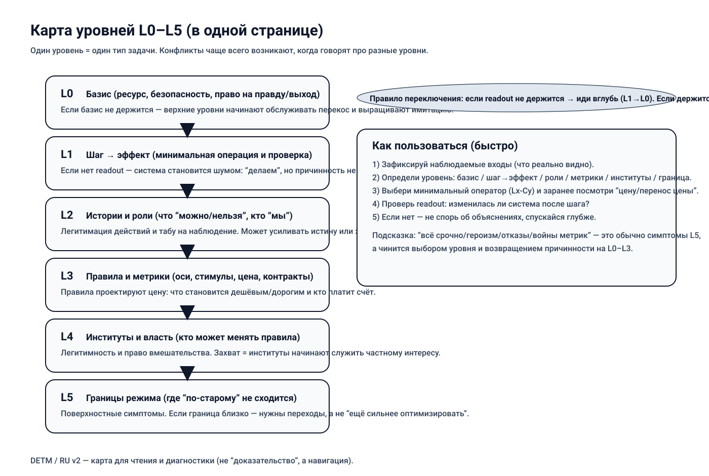

# Карта уровней L0–L5 (одна страница)

Текстовый fallback (если схема не рендерится):
- `L0`: базис (ресурс/безопасность/доверие/право остановки).
- `L1`: шаг -> эффект и короткий `readout`.
- `L2`: роли и истории, которые легитимируют поведение.
- `L3`: оси, метрики, правила, цена ошибки.
- `L4`: институты и легитимность изменения правил.
- `L5`: границы режима и переходы.

Если нужно объяснить модель за минуту — достаточно этой страницы.

