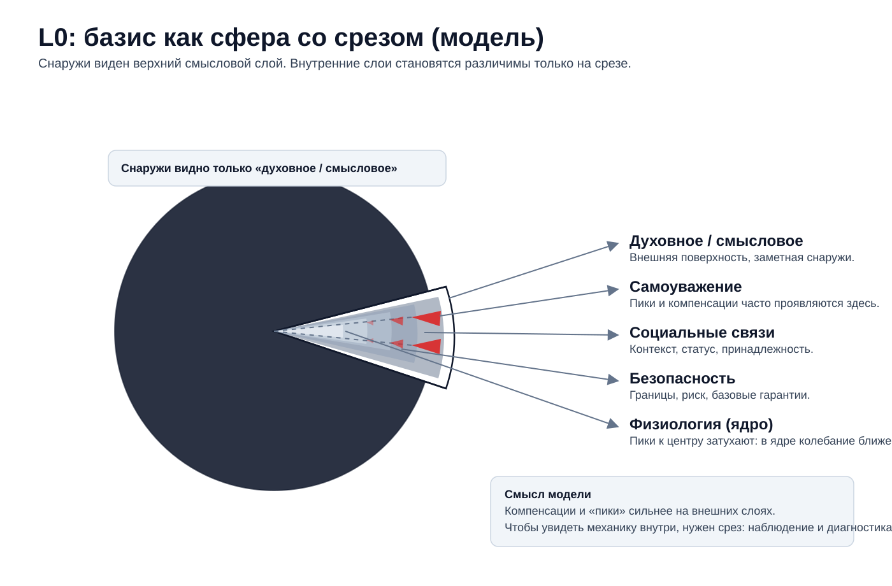

# L0: Существование (0/1) как минимальный инвариант (v2, черновик)

## 1) Определение уровня L0 (внутренний базис)

L0 описывает **бинарный факт удержания режима**: система либо продолжает существовать как система, либо распадается на шум.
Это не про комфорт и не про «успех». Это про минимальные условия, при которых вообще имеет смысл говорить о поведении (L1), ролях/моделях (L2), правилах/метриках (L3), институтах (L4) и границах/переходах (L5).

Операционально (без морали):

- `L0 = 1`, если на горизонте `T0` базовые контракты/обещания/ограничения **не переходят в режим регулярного дефолта**, и у системы остаётся причинность (можно связывать действия с последствиями).
- `L0 = 0`, если система вынуждена жить в режиме постоянного тушения провалов базиса: последствия отрываются от действий, обратная связь ломается, остаётся только борьба за следующий шаг.

Примеры базиса (не исчерпывающие):

- человек: сон/еда/безопасность/минимальное доверие к среде;
- команда/организация: доверие, базовые обещания, платежеспособность, минимальная предсказуемость правил;
- проект/продукт: энергия команды, канал обратной связи, бюджет/время, право остановиться.

### L0 как датчики

L0 не измеряется одной цифрой. Но у него есть грубые датчики:

- **регулярный дефолт по базовым обязательствам** (обещания ломаются системно, а не как исключение);
- **переход в режим имитации** (отчёт остаётся, причинность исчезает);
- **готовность базиса участвовать**: если люди/узлы перестают «вкладываться» (вниманием, риском, качеством), это ранний сигнал рассинхронизации.

Ключевая формулировка, которую дальше будем проверять на кейсах:

> Готовность L0 участвовать — ранний датчик лжи системы.

Под «ложью» здесь понимается не мораль, а ситуация, когда системе становится дешевле производить отчёт/видимость, чем поддерживать реальность.

### L0 как операторы (что может делать)

Операторы L0 грубые, но честные:

- остановка («стоп», «пауза», «выключить», «заморозить»)
- выход («не участвую», «разрываю контракт», «ухожу»)
- сокращение нагрузки до базиса (режим выживания как временная мера)
- восстановление причинности (вернуть обратную связь, вернуть цену ошибок на источник)

Важно: L0-операторы почти всегда выглядят «иррационально» с верхних уровней, потому что они не оптимизируют цель — они сохраняют возможность оптимизации.

### Геометрия базиса: «октаэдр потребностей» и перекосы

Чтобы не превращать L0 в список «важных тем», удобно держать геометрию: базис — это **компенсатор** нескольких полюсов.
Можно мыслить это как «октаэдр потребностей»: система пытается удержать форму в равновесии между `есть/нет`.

Что здесь важно как наблюдаемая механика (а не как красивая метафора):

- если один полюс долго уходит в дефицит (сон/еда/безопасность/принадлежность/самовыражение — как примеры), возникает **перекос**;
- перекос на L0 почти всегда вынуждает верхние уровни **смещать оптимизацию** под этот дефицит;
- тогда L1 становится более реактивным (сужение горизонта, триаж), L2 легитимирует «почему так надо», L3 переписывает правила/метрики, L4 закрепляет власть/норму вокруг перекоса;
- снаружи это может выглядеть как «люди испортились» или «культура поменялась», но в этой книге это читается проще: **верхние уровни обслуживают перекос базиса**.

Практический вывод: прежде чем спорить про ценности/правила/метрики, полезно зафиксировать наблюдаемые входы базиса и проверить, какой полюс перекашивает систему прямо сейчас.

### Границы применимости L0

Жизнь непрерывна, но **переход управляемости в неуправляемость** часто скачкообразен.

- можно долго жить в «почти-нуле» и при этом иметь красивые отчёты;
- но когда базис проваливается, верхние уровни перестают быть причинными: объяснения (L2) превращаются в рационализации, метрики (L3) — в шум, институты (L4) — в фиксацию лжи.

## 2) Типы уровня L0

Здесь «типы» — это не психотипы людей, а устойчивые траектории поведения/организации вокруг базиса.

### Психология: типы

**Тип: выживание через сужение мира.**
Человек/команда режет горизонт до ближайшего шага: «сделать сегодня» важнее смысла и стратегии.
Снаружи это выглядит как деградация, но внутри это попытка вернуть управляемость, когда причинность уже рвётся.

Проекции вверх (L0→L5): на L1 это обычно выглядит как триаж и реактивность; на L2 — как легитимация «сейчас не до смыслов»; на L3 — как приоритет срочного и метрик скорости; на L5 чаще всего проявляется как `T4` (снижение обязательств/горизонта) и/или `T1` (пауза/остановка как попытка вернуть причинность).

**Тип: героический режим (перерасход базиса).**
Система держится за счёт постоянного превышения мощности: переработки, ручного управления, личного риска.
Это может давать короткие победы, но почти всегда создаёт долг, который потом проявится как внезапный провал L0.

Проекции вверх (L0→L5): на L1 — скорость и ошибки вперемешку, вытеснение восстановления; на L2 — мифология «спасателей» и запрет паузы; на L3 — стимулы под срочность; на L5 типовой хвост — `T3` (героизм как режим) с обрывом/границей.

**Тип: отказ как самозащита.**
Когда цена участия становится выше цены отказа, базис выбирает «0»: уход, молчание, саботаж, имитация.
Это не «плохое поведение»; это сигнал несходимости цены удержания режима.

Проекции вверх (L0→L5): на L1 — формальное выполнение или исчезновение участия; на L2 — войны интерпретаций («люди плохие» vs «система врёт»); на L3 — попытки «додавить» метриками; на L5 почти неизбежно проявляется `T2` (массовый отказ/разрыв связи с ложью).

### Социология/организации: типы

**Тип: система, которая держится на доверии, а не на контроле.**
Базовые обещания выполняются; исключения признаются; цена ошибок не перекладывается вниз.
В такой системе L0 устойчив, и верхние уровни (правила/метрики/институты) остаются причинными.

Проекции вверх (L0→L5): на L1 шаги имеют readout и не требуют героизма; на L2 правду можно произносить; на L3 метрики остаются датчиками; на L4 есть легитимные права остановки/выхода; на L5 это чаще проявляется как `T6` (работающая обратная связь) и снижение риска каскадов (`T5`).

**Тип: система, которая держится на страхе и имитации.**
На коротком горизонте можно заставить «делать вид»: отчётность растёт, но готовность участвовать падает.
Снаружи это часто выглядит как эффективность, пока не наступает резкий обрыв (утечка людей, авария, каскад дефолтов).

Проекции вверх (L0→L5): на L1 много «движения» без проверки; на L2 табу и назначение виноватых; на L3 метрики становятся отчётом; на L4 усиливается контроль интерпретации; на L5 это обычно читается как `T7` (контроль осей) + `T2` (скрытые отказы) и каскады (`T5`).

### Экономика/стимулы (если применимо): типы

**Тип: платежеспособность как базис.**
Когда нет буфера (денег/времени/мощности), любое отклонение становится экзистенциальным.
Система начинает оптимизировать не цель, а шанс дожить до завтра — и это нормально для L0, но опасно, если притворяться, что мы на L3.

Проекции вверх (L0→L5): на L1 — выбор «самого срочного»; на L2 — оправдание «иначе нельзя»; на L3 — переподписание обязательств или скрытый перенос цены; на L5 типовые формы — `T4` (снижение обязательств) и `T3` (перерасход), а при несходимости участия — `T2`.

## 3) Сквозные ситуации: действие на уровне L0

Сквозные кейсы мы ведём в разделе [«Реестр ситуаций»](#case-registry).
В главе L0 интересуют кейсы, где **само действие** — бинарное: остановка/выход/отказ/перевод в режим выживания.

### L0-C1: Остановка как защита причинности

**Действие (L0)**: остановить процесс (релиз, проект, взаимодействие), когда цена продолжения начинает расти быстрее, чем польза.

**Эффект на L1**: падает темп, появляется пауза для восстановления; уменьшается хаос.

**Эффект на L2**: конфликт интерпретаций («слабость» vs «ответственность»); борьба за объяснение.

**Эффект на L3**: появляется окно пересборки датчиков: метрики можно снова сделать readout (а не отчётом) и зафиксировать условие остановки.

**Эффект на L4**: тест легитимности: кто имеет право остановить и кто платит цену.

**Эффект на L5**: предотвращение бифуркации в необратимый режим (каскад, захват, деградация обратной связи).

### L0-C2: Отказ участвовать как датчик лжи

**Действие (L0)**: базис **пассивно** перестаёт вкладываться (снижение усилия, «тихий уход», формальное выполнение, молчание, саботаж), потому что участие стало несходимым по цене.

**Эффект на L1**: меняется поведение (формальное выполнение, выученная беспомощность, отложенные решения).

**Эффект на L2**: рождаются рационализации и конфликты ролей («они ленивые» vs «система врёт»).

**Эффект на L3**: метрики дрейфуют от реальности: отчёт может «держаться», пока участие падает; растёт давление на цифры и игра в видимость.

**Эффект на L4**: ускоряется захват/распад институтов: исчезает добровольная легитимность.

**Эффект на L5**: система приближается к границе смены режима (внешне может быть незаметно по отчёту).

## 4) Обратная проекция: как L0 видится глазами других уровней

### Взгляд L1 на L0

L0 видится как усталость, ошибки, текучка, «не хочет работать». L1 фиксирует симптомы, но не всегда видит базис.

### Взгляд L2 на L0

L0 видится как кризис смысла/идентичности: «во что мы играем» и «почему это больше не работает».
L2 часто пытается лечить L0 словами; это иногда помогает (если возвращает причинность), но часто превращается в косметику.

### Взгляд L3 на L0

L0 видится как ограничения и мощность: ресурс, буфер, предсказуемость, право остановки, качество обратной связи.
Если базис просел, любые правила и метрики перестают быть причинными: цифры остаются, но управляемость исчезает.
Для L3 ключевой вопрос к L0: «какой минимальный контракт/датчик ещё держится, и что нужно вернуть, чтобы метрики снова были readout, а не отчётом».

### Взгляд L4 на L0

L0 видится как вопрос легитимности: «почему люди/узлы ещё участвуют».
Если участие держится только на принуждении, это уже сигнал деградации базиса.

### Взгляд L5 на L0

L0 видится как ближайшая граница: где ещё можно удержать режим, а где уже нужен переход.

## 5) Переходы (try/except): когда «подниматься» и когда «опускаться»

### Разрешённые переходы

- из L3/L4 вниз в L0, когда метрики/правила/институты начинают создавать имитацию и рвут причинность;
- из L0 вверх, когда базис стабилизирован и можно снова обсуждать модели и управление.

### Запрещённые переходы

- пытаться чинить провал L0 чисто на L3 (метриками) или L2 (объяснениями), не возвращая цену ошибок и обратную связь;
- запрещать отказ: если системе нельзя уходить/останавливаться, она будет копить скрытые отказы и развалится внезапно.

## Итог (за 1 минуту)

- L0 — это не «психология», а базовая **возможность причинности** (есть/нет).
- Если L0 просел, верхние уровни почти неизбежно начнут обслуживать перекос (и выглядеть «логично», но не причинно).
- Первый шаг почти всегда грубый: `L0-C1` (пауза), `L0-C4` (снижение обязательств), `L0-C6` (вернуть обратную связь), `L0-C2` (нормализовать отказ).

**Перевод на действия (без метафор):**
- Зафиксируй право остановки/отказа без наказания (`L0-C1`, `L0-C2`).
- Снизь обязательства до мощности, прежде чем «улучшать процессы» (`L0-C4`).
- Верни честную обратную связь как условие участия (`L0-C6`) или выходи из игры отчёта (`L0-C7`).

Мини-чеклист:
- Есть ли регулярные дефолты по базовым обязательствам?
- Есть ли право остановки/выхода без наказания?
- Есть ли хотя бы один честный readout (что меняется после шага)?

