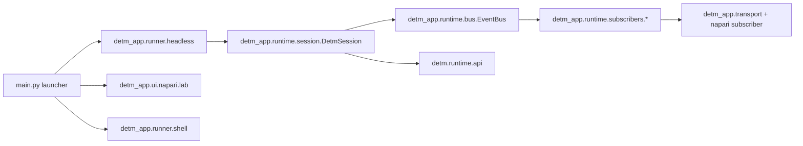

# DETM Architecture (EN)

This document describes the current DETM architecture and the boundary between library-core (`detm/*`) and app-layer (`detm_app/*`).
Russian version: `docs/rus/architecture.md`.
North-star synthesis: `docs/rus/30_architecture/target_architecture_synthesis.md`.

DETM remains pure L0 dynamics. UI/CLI/shell/fabric orchestration lives in the app layer and talks to L0 through runtime contracts.

---

## 1) Runtime Contract (L0 API)

Canonical API: `detm/runtime/api/*`:

- `reset(config: DETMConfig, seed: int) -> DETMState`
- `step(state: DETMState, influence: DETMInfluence | None, n_ticks: int, rng: np.random.Generator | None = None) -> (DETMState, Observables)`
- `digest(state: DETMState) -> DETMSignature`
- `serialize_state(state: DETMState) -> bytes`
- `deserialize_state(blob: bytes) -> DETMState`
- `get_schema_versions() -> dict[str, str]`

Invariants:
- `n_ticks` is an integer tick count (tick-driven time).
- stochastic behavior uses `rng`/`state.rng_state` (determinism).
- `step()` returns observables with no UI dependency.

---

## 2) Runtime/Orchestration (app-layer)

Orchestration has moved from legacy `detm.run` into `detm_app/runtime/*`:

- `detm_app/runtime/session/core.py`: `DetmSession` (single-writer loop over L0 API).
- `detm_app/runtime/scheduler.py`: `TickScheduler`, `TickRunner`.
- `detm_app/runtime/bus.py`: synchronous `EventBus` for subscribers.
- `detm_app/runtime/coarsening.py`: invariant tick streams (`InvariantCoarsener`).
- `detm_app/runtime/subscribers/*`: trace/watch/commit/fabric/viz subscribers and writers.

`TickRunner` semantics remain:
1. Apply all due influences without advancing time.
2. Perform exactly one L0 tick.

---

## 3) Influence API

`DETMInfluence` is the external influence port for L0.

- symbols: `detm/runtime/symbols.py` (`make_symbol`, `list_symbols`)
- application: `detm/runtime/influence/*` (`apply_influence`)

Input sources (mouse/keyboard/sensors) are normalized into `external_features` and stay outside core physics.

---

## 4) Entrypoints and launch model

Single launcher: `main.py`.

- `python main.py` starts napari interactive mode by default (`--interactive`).
- `python main.py napari ...` starts napari lab/subscriber flow.
- `python main.py headless ...` runs explicit headless CLI.
- `python main.py shell ...` runs role-based orchestration (`controller/runner/viewer`).
- `python main.py --help` shows launcher-level modes only.
- `python main.py headless --help` shows full headless parameter list.

Note: `python main.py ui ...` is kept as a legacy alias for `napari`; canonical command is `napari`.

---

## 5) Visualization: in-process and TCP

Visualization remains a read-only subscriber/consumer:

- in-process interactive UI: `detm_app/ui/napari/interactive/*`
- producer + napari subscriber: `detm_app/ui/napari/lab.py`, `detm_app/ui/napari/subscriber.py`
- TCP hub/daemon: `detm_app/transport/daemon.py` + `detm_app/transport/*`

This keeps rendering/networking outside the L0 step.

---

## 6) Fabric in current tree

Fabric runtime is consolidated under `detm/runtime/fabric/*` (delivery/quorum/epoch/validator/transport).
Subscriber wiring and runtime artifact persistence are attached via `detm_app/runtime/subscribers/fabric/*`.

Canonical protocol details: `docs/rus/30_architecture/commit_protocol.md`.
