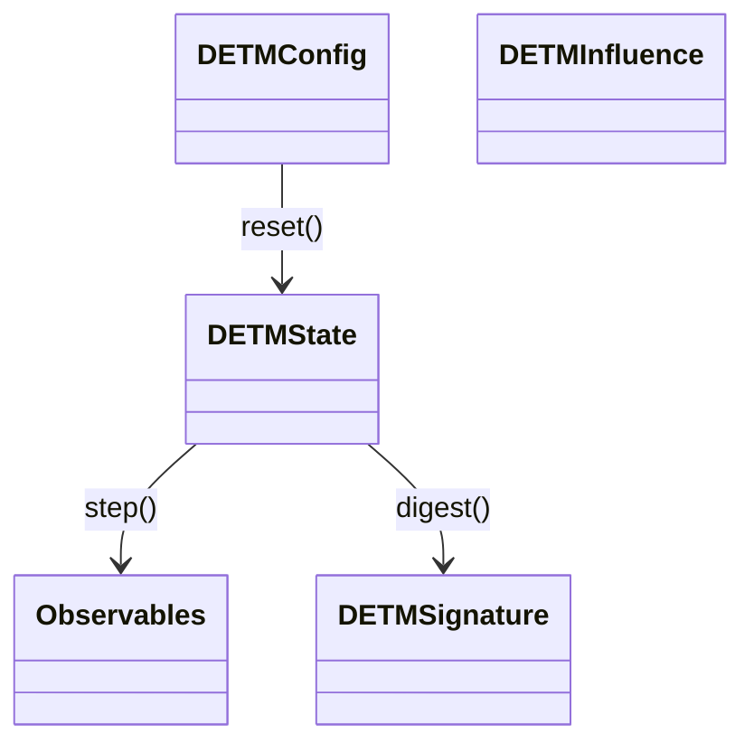

# DETM Integration Contract

This document defines the minimal stable API and reproducibility requirements needed to integrate DETM into external runtimes (ACGS Scheduler, ComfyUI, etc.).

DETM is **pure L0 dynamics**. It does **not** depend on a scheduler or UI. External systems interact only through:
- the runtime API (`reset/step/digest/serialize/deserialize`)
- typed influences
- returned observables (signatures/metrics/events)

---

## Core API (L0)

Canonical implementation: `detm/runtime/api/*`.

- `reset(config: DETMConfig, seed: int) -> DETMState`
- `step(state: DETMState, influence: DETMInfluence | None, n_ticks: int, rng: np.random.Generator | None = None) -> (DETMState, Observables)`
- `digest(state: DETMState) -> DETMSignature`
- `serialize_state(state: DETMState) -> bytes`
- `deserialize_state(blob: bytes) -> DETMState`
- `get_schema_versions() -> dict[str, str]`

`serialize(state)` / `deserialize(blob)` aliases are allowed but must behave identically.

### UML-style sketch

---

## Determinism / reproducibility

- **Single RNG mechanism**: all stochastic operations must use the provided `rng` (or `state.rng_state`). No hidden `np.random` / `torch.rand`.
- **Same inputs → same outputs**: same seed + same config + same influence sequence must produce the same `digest` / signatures.

---

## Config

`DETMConfig` defines:
- lattice (`width/height/boundary`)
- runtime backend (`backend`: `"torch"` preferred, `"numpy"` reference/fallback)
- device (`device`: `"cpu"`, `"cuda"`, `"cuda:0"`, etc.)
- dynamics parameters (`dynamics`: `alpha/beta/gamma/kappa/lambda_t/...`)

Schema versions are part of the contract:
- config/state/signature versions are returned by `get_schema_versions()`.

---

## State

All mutable L0 state lives in one object: `DETMState`:
- fields (`energy`, `entropy`, `internal_time`) in `DETMFieldState`
- tick counter (`step_count`)
- deterministic RNG snapshot (`rng_state`)
- config snapshot (`config`) for persistence

Numeric arrays are backend-owned:
- `numpy.ndarray` (CPU)
- `torch.Tensor` (CPU/CUDA)

Backends must not “convert” state representations; they only advance them.

---

## Serialization

- `serialize_state(state) -> bytes`
- `deserialize_state(blob) -> DETMState`

Requirement: forward-compatible via `state_version`.

---

## Influence API

`DETMInfluence` describes external influence:
- `symbol_id: str`
- `amplitude: float`
- optional: `phase`, `seed`
- optional: `mask` or `region`
- optional: `duration`
- optional: `external_features: np.ndarray | dict[str,float]` (generic external features)
- optional: `dynamics_overrides: dict[str,float]` (temporary parameter overrides)

Symbol library:
- `detm/runtime/symbols.py`: `make_symbol()`, `list_symbols()`

---

## Step semantics and observables

`step()` uses integer ticks (`n_ticks: int`), so orchestrators can remain tick-driven.

`Observables` includes:
- `signature` (short summary vector)
- `field_summaries` (minimal stats)
- `events` (e.g. attractors, applied influence)
- `cost` (time/ops/memory proxies)
- `quality` (signature-level proxies)

---

## Headless harness (no UI)

Supported:
- `main.py` launcher (`python main.py headless ...`) backed by `detm_app.runner.headless`
- `tools/headless_runner.py` (simple integration harness)

---

## Visualization boundary (pluggable sink)

Visualization is not part of L0. It is a separate consumer of serialized state frames.

Implemented modes:
- `embedded`: in-process rendering (no sockets)
- `tcp`: state frames streamed to a headless daemon; viewers subscribe

---

## Runtime bridge (optional)

For systems that want session management, `detm/integrations/runtime_bridge.py` provides an in-process bridge:
- `create_session(config, seed) -> session_id`
- `session_step(session_id, influence, n_ticks) -> (signature, observables, state_digest)`
- `session_get_state_blob(session_id)`

---

## Watch Contract (artifact-first)

`watch_contract.jsonl` is the canonical read-only projection packet (see `detm/runtime/watch_contract.py`):
- `trace_ref` linkage to System Trace
- `outerfields_ref` artifact reference
- `metrics.watchpoints` and `policy` projections

`anti_goodhart` is now a formalized sub-contract in both:
- `policy.anti_goodhart`
- `metrics.watchpoints.anti_goodhart`

Normalized fields:
- `goodhart_flag: bool`
- `target_signal: str`
- `target_delta: float`
- `degraded_signals: list[str]`
- `degraded_signal_count: int`
- `thresholds.target_signal: str`
- `thresholds.min_target_delta: float`
- `thresholds.min_degraded_signals: int`
- `thresholds.degradation_epsilon: float`
- `policy_reaction.apply: bool`
- `policy_reaction.actions: list[str]`
- `policy_reaction_enabled: bool`
- `preferred_runtime_profile: str`
- `runtime_profile_applied: bool`
- `applicability: str`

Flattened watchpoint mirrors (for quick consumers):
- `anti_goodhart_flag`
- `anti_goodhart_degraded_signal_count`
- `anti_goodhart_policy_reaction_applied`
- `anti_goodhart_runtime_profile_applied`

---

## Analytics read-model (app-layer, post-run)

The implemented analytics layer does not change the canonical runtime API and does not introduce direct DB writes from runtime/subscribers.

Supported entrypoints:
- `python main.py headless analytics ingest --run-dir <path>`
- `python main.py headless analytics summarize --run-dir <path>`
- `python main.py headless analytics query --db <path> --sql <query>`
- Python API: `ingest_run(run_dir)`, `summarize_run(run_dir)`, `open_run_db(run_dir)`

Derived outputs next to a completed run:
- `analytics.sqlite`
- `analytics/run_summary.json`
- `analytics/event_windows.jsonl`
- `analytics/decision_windows.jsonl`
- `analytics/outerfields_index.jsonl`

Contract:
- raw artifact-first outputs (`trace/watch/contract/outerfields/state`) remain the source of truth;
- SQLite stores summaries/refs/meta, not dense arrays;
- ingest is idempotent;
- the result must be marked honestly as `ok`, `partial`, or `broken`.

---

## Multiscale bridge catalog (MSC-01, observe-only)

The current multiscale baseline is not runtime acceleration. It builds derived multiscale readout on top of `step` events.

Current surface:
- `DETMConfig.multiscale_catalog`
- a local bounded ring buffer in `detm.runtime.pattern_memory`
- a bridge-shaped record scaffold:
  - `window_signature`
  - `interface_signature`
  - `horizon_k`
  - `forward_descriptor`
  - `reverse_descriptor_short`
  - `validity_envelope`
  - `db_refs`
- derived artifacts:
  - `multiscale_candidates.jsonl`
  - `scale_tension.jsonl`
  - `operator_catalog_hits.jsonl`

Observe-only semantics:
- canonical `DETMState` remains owned by runtime/session;
- the multiscale layer does not perform `jump`, `refine`, `promote`, or substitute execution;
- Redis is not required for a completed run and is not a source of truth;
- when `redis_url` is present, artifacts and `config.json` expose only a safe endpoint form without credentials.

---

## Transitional boundaries (not final architecture)

The following must not be treated as final architecture:
- `analytics.sqlite` does not replace the raw artifact-first layer;
- `multiscale_catalog` is not yet a full `Ln <-> Ln+1` executable bridge runtime;
- the current `BridgeRecord` does not store full forward/reverse trajectory bodies;
- Redis hot transport and the trajectory store DB are not implemented yet;
- particle/macronode semantics, `hint` execution, and guarded `jump` remain later stages.
