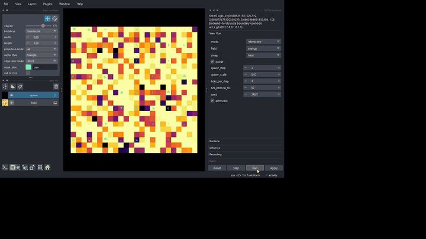

# Model Media Artifacts

This directory stores curated media artifacts for README/docs demos.

## Folder Layout

- `docs/media/source/video_*.mp4` - source captures
- `docs/media/gif/video_*.gif` - short GIF previews
- `docs/media/png/video_*/*.png` - extracted frames (start/middle/end + intermediate)

## Numbering

- `video_000` is a legacy demo capture (no source mp4 in repo).
- `video_001..video_008` are numbered source recordings migrated from dated filenames.
- source filename mapping is stored in `docs/media/source/mapping.json`.

## Quick Embed

```md

```
