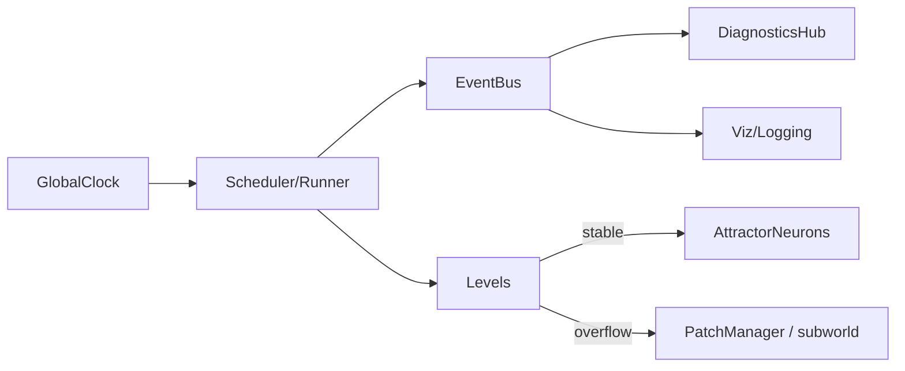

# Системная архитектура (набросок из исходников)

Тема относится к архитектуре “среды экспериментов” (оркестратор/ACGS) и хранится как `90_notes`.
В DETM-репозитории каноном остаётся L0 API и runtime-обвязка; эта страница фиксирует термины из исходных материалов.

## Компоненты (концепт)

- `GlobalClock` — единый источник тиков (порядок причинности)
- `EventBus` — системная шина событий
- `Levels` — набор уровней с разными частотами активации
- `AttractorNeurons` — O(1)-операторы (библиотека инвариантов)
- `PatchManager` — fallback/subworld
- `DiagnosticsHub` — внешняя диагностика (читает snapshot-и, не вмешивается)

Связанные заметки:
- fallback/subworld: `docs/rus/90_notes/fallback_subworld.md`

