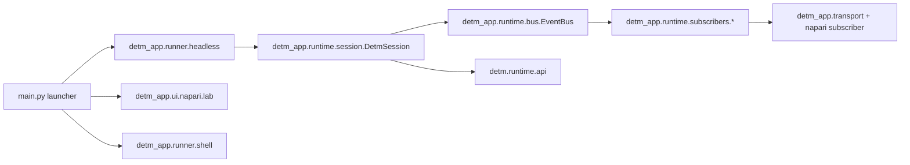

# Архитектура DETM (RU)

Этот документ фиксирует текущее состояние архитектуры DETM и соответствие между library-core (`detm/*`) и app-layer (`detm_app/*`).
Английская версия: `docs/eng/architecture.md`.
Целевая сводка (north star): `docs/rus/30_architecture/target_architecture_synthesis.md`.

DETM остаётся чистой L0-динамикой. UI/CLI/shell/fabric-orchestration находятся в app-слое и работают через контракты runtime.

---

## 1) Runtime Contract (L0 API)

Канонический API: `detm/runtime/api/*`:

- `reset(config: DETMConfig, seed: int) -> DETMState`
- `step(state: DETMState, influence: DETMInfluence | None, n_ticks: int, rng: np.random.Generator | None = None) -> (DETMState, Observables)`
- `digest(state: DETMState) -> DETMSignature`
- `serialize_state(state: DETMState) -> bytes`
- `deserialize_state(blob: bytes) -> DETMState`
- `get_schema_versions() -> dict[str, str]`

Инварианты:
- `n_ticks` — целое число тиков (tick-driven модель времени).
- стохастика идёт через `rng`/`state.rng_state` (детерминируемость).
- `step()` возвращает observables без зависимости от UI.

---

## 2) Runtime/Orchestration (app-layer)

Оркестрация вынесена из legacy `detm.run` в `detm_app/runtime/*`:

- `detm_app/runtime/session/core.py`: `DetmSession` (single-writer цикл поверх L0 API).
- `detm_app/runtime/scheduler.py`: `TickScheduler`, `TickRunner`.
- `detm_app/runtime/bus.py`: синхронный `EventBus` для subscribers.
- `detm_app/runtime/coarsening.py`: invariant tick streams (`InvariantCoarsener`).
- `detm_app/runtime/subscribers/*`: trace/watch/commit/fabric/viz подписчики и writers.

Семантика `TickRunner` неизменна:
1. На каждом глобальном тике применяются due-влияния без продвижения времени.
2. Затем выполняется ровно один L0 тик.

---

## 3) Influence API

`DETMInfluence` — внешний порт воздействия на L0.

- символы: `detm/runtime/symbols.py` (`make_symbol`, `list_symbols`)
- применение: `detm/runtime/influence/*` (`apply_influence`)

Источники влияния (мышь/клавиатура/датчики) нормализуются в `external_features` и не вшиваются в ядро.

---

## 4) Entrypoints и запуск

Единая точка входа: `main.py`.

- `python main.py` — napari interactive mode по умолчанию (`--interactive`).
- `python main.py napari ...` — napari lab/subscriber flow.
- `python main.py headless ...` — явный headless CLI.
- `python main.py shell ...` — role-based orchestration (`controller/runner/viewer`).
- `python main.py --help` — launcher-level help (только режимы запуска).
- `python main.py headless --help` — полный список headless параметров.

Примечание: `python main.py ui ...` сохранён как legacy alias для `napari`, но канонический путь — `napari`.

---

## 5) Визуализация: in-process и TCP

Визуализация остаётся read-only подписчиком артефактов/состояния:

- in-process interactive UI: `detm_app/ui/napari/interactive/*`
- producer + napari subscriber: `detm_app/ui/napari/lab.py`, `detm_app/ui/napari/subscriber.py`
- TCP hub/daemon: `detm_app/transport/daemon.py` + `detm_app/transport/*`

Это отделяет L0 шаг от рендера и сетевой доставки.

---

## 6) Fabric в текущем дереве

Fabric runtime собран в `detm/runtime/fabric/*` (delivery/quorum/epoch/validator/transport).
Subscriber wiring и запись runtime-артефактов подключаются через `detm_app/runtime/subscribers/fabric/*`.

Канонический протокол и термины: `docs/rus/30_architecture/commit_protocol.md`.
