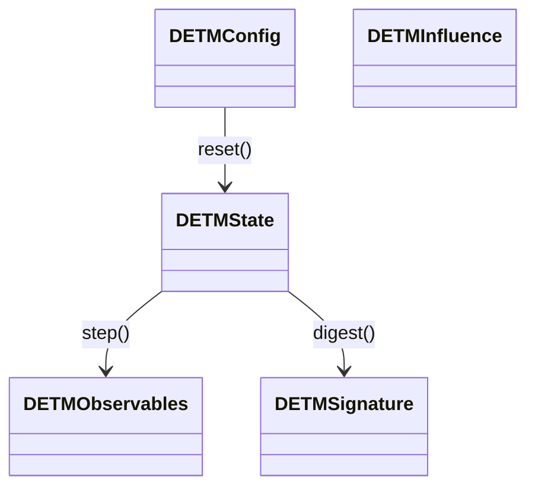

# DETM: контракт интеграции

English version: `docs/eng/integration_contract.md`

Этот документ фиксирует минимальный API и требования воспроизводимости, необходимые для подключения DETM к внешним рантаймам (ACGS Scheduler, ComfyUI и др.). DETM остаётся чистой L0‑динамикой и не знает про UI/оркестраторы: извне она видит только конфигурацию, сиды, влияния и отдаёт наблюдаемые величины.

## Базовый API
- `reset(config: DETMConfig, seed: int) -> DETMState`
- `step(state: DETMState, influence: DETMInfluence | None, n_ticks: int, rng: np.random.Generator | None = None) -> tuple[DETMState, DETMObservables]`
- `digest(state: DETMState) -> DETMSignature`
- `serialize_state(state: DETMState) -> bytes`
- `deserialize_state(blob: bytes) -> DETMState`
- `get_schema_versions() -> dict[str, str]`

Допускаются алиасы `serialize(state)` / `deserialize(blob)` как более короткие имена,
но их сигнатуры и поведение должны быть идентичны `serialize_state`/`deserialize_state`.

### UML‑эскиз

### Детерминизм и воспроизводимость
- **Единый RNG**: все стохастические операции принимают `rng` явно (или используют `state.rng_state`). Никаких скрытых `np.random`/`torch.rand`.
- **Идентичные входы → идентичные подписи**: одинаковый `seed` и одна и та же последовательность `influence` должны давать одинаковый `digest`/`signature`.

### Конфигурация (промт 1.2)
- `DETMConfig` (dataclass/pydantic) содержит `config_version` и параметры решётки/динамики.
- `DETMConfig.backend`: выбирает численный бэкенд (`"torch"` предпочтителен, `"numpy"` как эталон/фолбэк).
- `DETMConfig.device`: `"cpu"`/`"cuda"`/`"cuda:0"` и т.п.; при отсутствии CUDA бэкенд должен автоматически деградировать до CPU (или до `numpy`).
- Любое изменение схемы → bump minor версии.
- Методы `to_dict()/from_dict()` фиксируют сериализуемый формат.

## Состояние (промты 2.1–2.3)
- Всё L0‑состояние собрано в едином `DETMState`: поля `E`, `τ` (если используется), дополнительные карты, внутреннее время, счётчики, `rng_state`.
- Численные поля (`E/S/τ`) принадлежат **бэкенду**: это могут быть `numpy.ndarray` или `torch.Tensor`. Бэкенд выполняет только переход
  «текущее состояние → будущее состояние» на `n_ticks` и **не приводит** состояние к единому формату (конверсия/сравнение/трансформации делаются снаружи).
- Сериализация: `serialize_state(state) -> bytes` (msgpack/npz) и `deserialize_state(blob) -> state` с `state_version` для forward‑compatibility. Смоук‑тест: `serialize→deserialize→digest` совпадает.
- `digest(state) -> DETMSignature`: компактный вектор (8–32 числа): энергия, энтропия/гладкость, доминирующая мода, центр массы, устойчивость/периодичность при наличии.

## Influence API (промты 3.1–3.2)
- `DETMInfluence`:
  - `symbol_id: str`
  - `amplitude: float`
  - `phase: float | None`
  - `seed: int | None`
  - `mask/region: np.ndarray | tuple | None`
  - `duration/n_ticks: int | None`
  - `external_features: np.ndarray | dict[str, float] | None`
- Функция `apply_influence(state, influence)` входит в `step()`; влияет на поля детерминированно через переданный `rng`.
- Каталог символов (`symbols/` или `influences/`): `make_symbol(symbol_id, **params) -> DETMInfluence`, минимум 5–10 готовых шаблонов.

## Step API и время (промты 4.1–4.2)
- `step()` принимает `n_ticks: int` (tick‑driven). Внутренняя физическая шкала (`dt`) хранится в `config`, но наружный интерфейс оперирует тиками.
- `influence` может быть `None` (шаг без внешних воздействий).
- Возврат `observables` включает:
  - `signature` (короткая подпись сразу после шага);
  - `field_summaries` (минимальные статистики по полям);
  - `events` (опционально: локальные аномалии/аттракторы);
  - `cost` (оценка стоимости шага: время, операции, память).

## Диагностика (промты 5.1–5.2)
- `detm/runtime/diagnostics/attractors.py`: `detect_attractors(state) -> list[Attractor]` с полями `position/region`, `strength`, `stability_score`, `period_estimate`.
- `stability_metrics(state, history_window)` возвращает статус «прогресс падает/плато/колебания» по динамике `signature`.

## Профили исполнения (промты 6.1–6.2)
- В `observables.cost` фиксируются `cpu_time_ms`, `step_ops_estimate`, `memory_bytes_estimate`.
- Вводятся 2–3 «quality proxy» метрики на уровне DETM: `jitter_signature`, `oscillation_score`, `saturation_score`.

## Boundary / Ports (промт 7.1)
- `external_features` — вектор (`np.ndarray` или `dict[str, float]`) внутри `DETMInfluence`; DETM трактует как дополнительные параметры поля без знания источника (мышь/клава/датчик).

## Тестовый стенд (промты 8.1–8.2)
- `tools/headless_runner.py`: читает config, создаёт алфавит символов, гоняет `N` эпизодов, сохраняет `signatures/metrics` в `.npz/.jsonl`.
- Golden‑тесты: фиксированный `seed` + фиксированная последовательность `influence` → финальный `digest` совпадает с эталоном.

## Версионирование (промты 9.1–9.2)
- `schemas.py` содержит `DETM_CONFIG_V1`, `DETM_STATE_V1`, `DETM_SIGNATURE_V1`; `get_schema_versions()` возвращает их.
- При bump версии — `migrate_state(blob, from_version, to_version)` (пока stub + документация), чтобы сохранять совместимость.

## Runtime bridge (промты 10.1–10.2)
- `integrations/runtime_bridge.py` предоставляет `DETMRuntimeBridge`:
  - `create_session(config, seed) -> session_id`
  - `session_step(session_id, influence, n_ticks) -> SessionStepResult(signature, observables, state_digest)`
  - `session_get_state_blob(session_id)`
- Без глобальных синглтонов: DETM должна поддерживать несколько одновременных сессий (или явный запрет). Рантайм-бридж организует изоляцию без UI/ComfyUI зависимостей.

## Definition of Done (минимум для интеграции)
- Реализованы `reset/step/digest/serialize/deserialize`.
- Повторяемость: фиксированный `seed` → одинаковый результат.
- Типизированный `Influence` + библиотека символов.
- `Observables` возвращаются без UI.
- Есть headless runner и golden‑тесты.
- Версии схем зафиксированы и доступны через `get_schema_versions()`.
